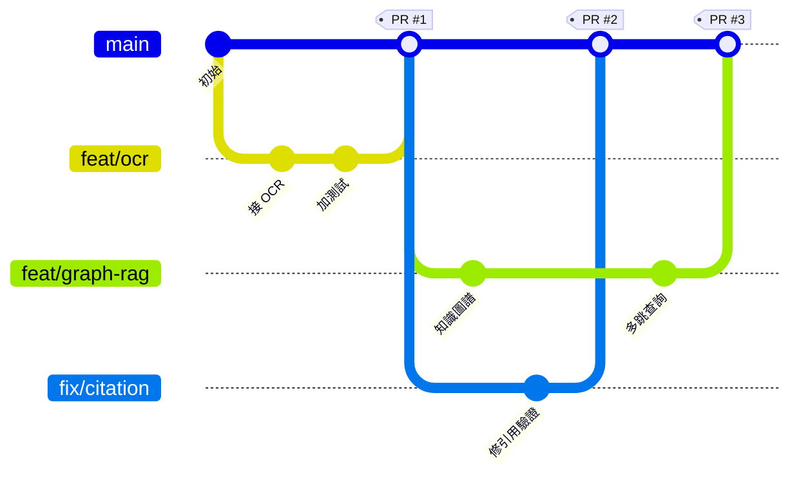

# 協作流程

## 1. 分支模型

我們用**簡化版 GitHub Flow**——不用 git-flow 的多層分支，
小團隊用不上，只會增加合併衝突。



| 分支 | 用途 | 命名 |
|---|---|---|
| `main` | 永遠可執行、`tests/test_core.py` 永遠全過 | — |
| 功能 | 新功能 | `feat/<簡短英文>`　例：`feat/ocr-layer` |
| 修錯 | Bug | `fix/<簡短英文>`　例：`fix/citation-ellipsis` |
| 文件 | 只改文件 | `docs/<簡短英文>` |
| 實驗 | 不確定會不會留 | `exp/<簡短英文>` |

## 2. 第一次加入專案

```bash
git clone https://github.com/wajason/flowmind-ai.git
cd flowmind-ai
uv venv .venv --python 3.11
source .venv/bin/activate            # Windows: .\.venv\Scripts\Activate.ps1
uv pip install -r requirements.txt
cp .env.example .env                 # Windows: Copy-Item .env.example .env
docker compose up -d
python -m flowmind.cli doctor        # 確認環境就緒
python tests/test_core.py            # 確認全部通過再開始改
```

## 3. 日常開發循環

```powershell
# ① 從最新的 main 開分支
git switch main
git pull origin main
git switch -c feat/ocr-layer

# ② 改東西…然後隨時確認沒把既有功能弄壞
python tests\test_core.py

# ③ 提交（訊息用中文沒關係，但要說清楚「為什麼」而不只是「改了什麼」）
git add .
git commit -m "接入 OCR：掃描件現在也能進 pipeline

原本只吃 text-based PDF，掃描件直接被 extract_pdf 回傳空字串。
改用 PaddleOCR 作為 fallback，並在 metadata 標記 ocr_applied，
讓後續的引用驗證知道這段文字有 OCR 誤差、不該用嚴格比對。"

# ④ 推上去
git push -u origin feat/ocr-layer

# ⑤ 開 PR
gh pr create --title "接入 OCR 層" --body "解決 #12。已補 3 項測試。"
```

## 4. Clone 之後的第一件事：啟用提交前檢查

```bash
git config core.hooksPath .githooks     # 啟用 pre-commit / commit-msg 檢查
cp .private-terms.example .private-terms  # 再依團隊實際情況填入內容
```

`.gitignore` 只擋得住「不小心 `git add`」；換個檔名的同類內容、或 commit 訊息本身，
它擋不住。所以檢查自動化成兩道 hook：

| Hook | 擋什麼 |
|---|---|
| `pre-commit` | 暫存區含 `.gitignore` 列出的本機路徑；或新檔案內容含清單詞彙 |
| `commit-msg` | commit 訊息含清單詞彙 |

也可以手動執行：

```bash
python scripts/check_public_safe.py --staged   # 檢查暫存區
python scripts/check_public_safe.py --all      # 檢查整個工作目錄與全部歷史訊息
```

> `.private-terms` 依各團隊環境自行維護、不進版控，版控裡只有 `.private-terms.example` 範本。
> 清單檔不存在時檢查會直接失敗而不是靜默放行——「找不到設定就自動通過」的檢查，
> 在剛 clone 的新環境剛好不會作用。

## 5. Code Review 檢查清單

在按下 Approve 前，這四項一定要看：

| # | 檢查 | 為什麼 |
|---|---|---|
| 1 | `python tests\test_core.py` 是否 **失敗 0**（項數會隨新增測試成長，看的是有沒有失敗，不是看總數） | 核心邏輯不能退步 |
| 2 | 有沒有新的 SQL 直接寫 `WHERE tenant_id` | 隔離應由 RLS 負責，手寫過濾是反模式 |
| 3 | 有沒有在 `crosscheck.py` / `metrics.py` 裡呼叫 LLM | 這兩個模組必須維持零 LLM |
| 4 | 新增的宣稱有沒有對應的測試或實測數字 | 文件裡的數字必須可重跑驗證 |

## 6. 常用指令速查

```powershell
git status                          # 現在改了什麼
git switch main                     # 切回主線
git switch -c feat/xxx              # 開新分支
git pull origin main                # 同步主線
git log --oneline --graph -15       # 看分支歷史

# 主線有更新，把我的分支接到最新的 main 上
git switch feat/xxx
git rebase main                     # 衝突時：改完後 git add . && git rebase --continue

git stash                           # 暫存未完成的修改
git stash pop                       # 取回

git restore <檔案>                  # 放棄某檔案的修改
git restore --staged <檔案>         # 從暫存區移除但保留修改

gh pr list                          # 看有哪些 PR
gh pr checkout 12                   # 把別人的 PR 抓下來測
gh pr create                        # 開 PR
```

## 7. 絕對不要提交的東西

`.gitignore` 已設定，但仍請確認：

| 不可提交 | 原因 |
|---|---|
| `.env` | 含資料庫密碼與 API 金鑰 |
| `data/raw/CASE-*/` | **客戶的發票、合約、銀行流水屬於營業秘密**，誤推上 GitHub 就收不回來 |
| `data/processed/` · `out/` | 衍生產物，可重新產生 |
| `.venv/` | 環境，各人自建 |

只有 `data/raw/SHARED/`（政府與行庫公開資料）例外放行。

```powershell
# 推之前養成習慣先看一眼
git status
git diff --cached --stat
```

---
