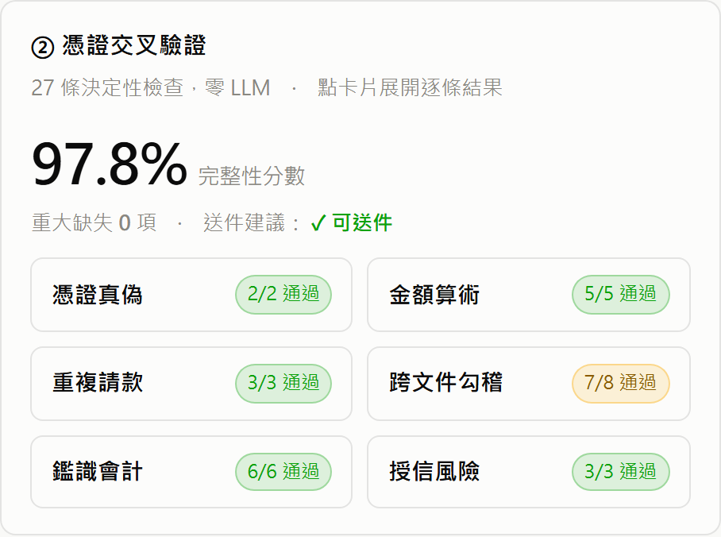
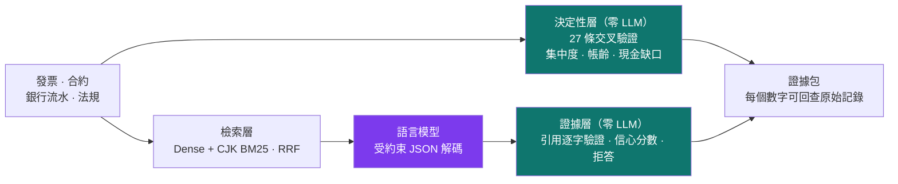
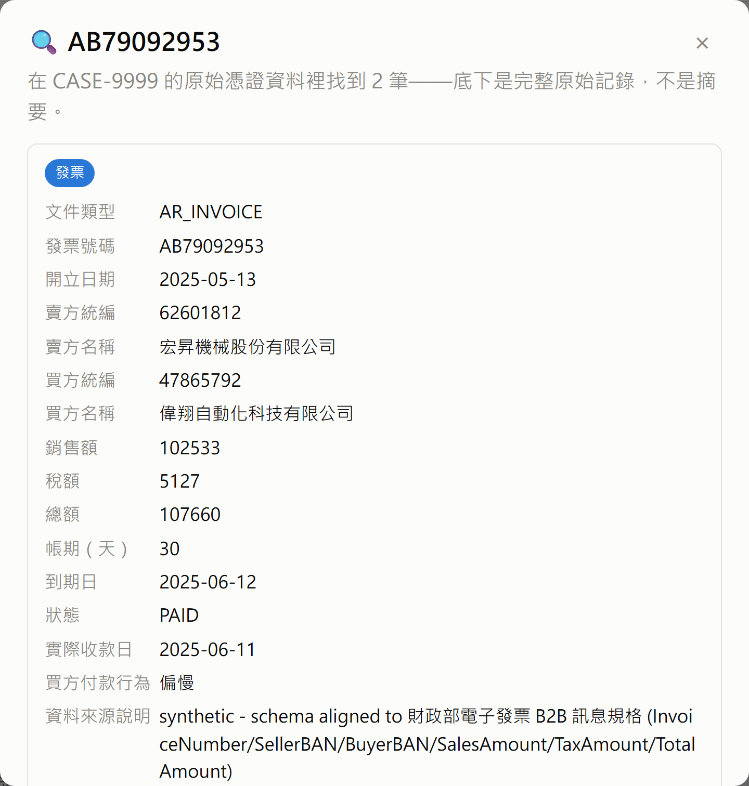

# FlowMind AI

**供應鏈融資的可驗證證據層** — 把中小企業的發票、合約、銀行流水，
整理成銀行授信人員可以逐項回查的證據包。

[](tests/test_core.py)
[]()
[]()
[]()
[](https://wajason.github.io/flowmind-ai/)

**🔗 線上展示：<https://wajason.github.io/flowmind-ai/>**（不需安裝，直接開）
　·　[中小企業送件前自檢](https://wajason.github.io/flowmind-ai/self-check.html)



---

## 它解決什麼問題

信保基金《供應商融資信用保證要點》允許供應商憑**訂單、發票、支票等佐證交易真實性的文件**撥貸，
保證成數最高九成。制度已經開了門，卡住的是執行面：一個案件動輒數十上百張憑證，
「這些憑證彼此對得起來嗎」目前靠人逐張核對，沒有工具、沒有留痕。

FlowMind 把這一段變成可程式驗證、可稽核、可重算的流程：

| 使用者 | 拿到什麼 |
|---|---|
| **銀行企金／信保機構的授信人員** | 審查工作台：系統先全量交叉驗證，人只看例外；每條警示都能點回原始憑證 |
| **中小企業財務人員** | 送件前自檢：上傳憑證、立刻知道還缺什麼，報告與銀行端看到的數字一致 |

**刻意不做**：授信決策、撮合、評分卡。系統只指出證據衝突，判斷仍由授信人員完成。

---

## 核心設計：確定性的外殼，包住機率性的核心

25 個核心模組中**只有 `llm.py` 呼叫語言模型**。凡是有明確規則可以算的，就不讓模型猜。



三個對金融場域最重要的機制：

- **交叉驗證零 LLM** — 27 條檢查（統編檢核、金額算術、重複請款、發票↔合約↔流水勾稽、
  帳齡、集中度）全部是可重算的程式邏輯，測試會讀模組原始碼確認沒有模型呼叫。
- **引用不是模型說了算** — 模型每個主張必須附逐字摘錄，由模型外的程式回到檢索文本做字串比對；
  對不上的主張直接從答案移除並列為未知，信心低於門檻就拒答。
- **委任案隔離由資料庫強制** — PostgreSQL Row-Level Security，應用程式以非 superuser 連線，
  沒有 `WHERE tenant_id` 也看不到別人的資料；稽核記錄以雜湊鏈串接。



---

## 快速開始

需要 Python 3.11、Docker、[Ollama](https://ollama.com)。完整步驟（含 Windows）見 [docs/SETUP.md](docs/SETUP.md)。

```bash
git clone https://github.com/wajason/flowmind-ai.git && cd flowmind-ai
uv venv .venv --python 3.11 && source .venv/bin/activate
uv pip install -r requirements.txt
ollama pull gemma4:26b && ollama pull bge-m3
docker compose up -d                 # PostgreSQL 17 + pgvector，port 5433
cp .env.example .env
python -m flowmind.cli doctor        # 環境自檢
python tests/test_core.py --core-only   # 111 項核心測試，不需資料庫
```

建好示範資料後（見 SETUP.md §3）：

```bash
python -m flowmind.dashboard                                    # 審查工作台 → :8000
python -m flowmind.cli crosscheck --tenant CASE-9999 --against-answer-key   # 抓注入的造假憑證
python rag_query.py --tenant CASE-0001 -q "信保基金供應商融資的保證成數最高幾成？"
python rag_query.py --verify-isolation CASE-0001 CASE-9999      # 跨委任案隔離證明
python -m flowmind.report --tenant CASE-9999                    # 授信證據報告 PDF
```

---

## 實測結果

| 項目 | 結果 |
|---|---|
| 造假憑證偵測（22 種樣態、220 次注入） | Recall 100% · Precision 70.4% · MCC 0.833 |
| 引用可驗證率（SROIE 361 份全量） | 99.93%，憑空生成 0.07% |
| 陷阱欄位（CORD 100 份，正確答案皆為空） | 600 個欄位全數留白，0 個憑空生成 |
| 法規問答（105 題） | 事實正確 91.4% · 應拒答題正確拒答 90% · 嚴格四項全中 78.1% |
| 檢索可重現性 | 同一查詢重跑結果完全一致（排序含決勝鍵） |
| 跨委任案隔離 · 稽核雜湊鏈 · 認證四情境 | 全數通過，可現場重跑 |
| 回歸測試 | 201 / 201 |

指標定義、重跑指令與完整輸出見 [docs/DEMO_RESULTS.md](docs/DEMO_RESULTS.md)；
評測指標為何這樣設計（HPES 讓亂猜在數學上不划算、反事實穩健度）見 [docs/SDD.md](docs/SDD.md) §7。

造假偵測刻意採**高召回、例外導向**的設定：漏抓一筆造假的代價遠高於多看一張憑證
（成本權重 20:1），誤報則已拆解到規則層級（84 次誤報集中在 8 條規則，前三條佔 48%），
是可逐條調整門檻的工程項目，不是黑盒。

**適用範圍與下一步**

- 輸入以電子憑證為主（電子發票 B2B 訊息格式、結構化 JSON/CSV、text-based PDF）；
  掃描件以 OCR 作為前處理接入，抽取與驗證層吃的都是文字，引用比對本身已支援近似命中
  （`partial_ratio ≥ 95` 標示為 near-match），能容納 OCR 的字元級誤差。
- 外部 benchmark 驗證的是抽取與拒答能力；中文 B2B 憑證的交叉驗證以可重現的合成資料
  與注入缺陷驗證邏輯正確性，真實環境的表現由平行驗證（Shadow Mode）取得，不預先宣稱。
- 拒答閘門刻意用獨立校準集調整、不用評測集本身，避免資料洩漏；105 題中仍有少數
  過度保守題，屬可校準項。
- `gemma4:26b` 在 8GB 顯存上可運行（冷啟動約 2 分鐘，常駐後每題數秒）；
  正式部署建議 16GB 以上顯存或改接雲端 API，程式碼零修改。

---

## 資料來源

| 來源 | 用途 |
|---|---|
| 政府電子採購網決標公告 | 真實 B2B 交易結構（統編、金額、履約期間） |
| 全國法規資料庫、信保基金保證要點、行庫商品說明 | 問答的法源與制度依據 |
| 中小企業白皮書統計（29 份 CSV） | 產業側寫，數字可回溯到原始列 |
| 合成委任案（`generate_synthetic_data.py`） | 私人買方付款行為、銀行流水勾稽、注入缺陷的負向對照組 |
| SROIE / FUNSD / CORD | 抽取與拒答的外部 benchmark |

合成資料的價值是「答案由建構方式決定」，用來驗證邏輯正確性，不能用來宣稱真實世界準確率。

---

## 專案結構

```
flowmind/          核心套件：crosscheck（交叉驗證）· evidence（引用驗證）· retrieval · db（RLS）
                   metrics · watchtower（主動監控）· dashboard（FastAPI）· report（PDF）· llm
scripts/           資料抓取、評測執行器、模型選型、儀表板截圖、靜態展示打包
tests/test_core.py 201 項回歸測試
sql/init/          schema 與 RLS policy
data/raw/          SHARED（公開資料）與各委任案（合成資料）
docs/              設計文件、評測結果、模型選型
demo/              線上展示（由 scripts/build_static_demo.py 從實際 API 快照產生）
```

## 文件

| 文件 | 內容 |
|---|---|
| [docs/SETUP.md](docs/SETUP.md) | 環境建置（Linux / Windows）、建資料、日常指令、評測指令 |
| [docs/SDD.md](docs/SDD.md) | 軟體設計規格：架構、資料模型、三層 benchmark、Roadmap |
| [docs/DEMO_RESULTS.md](docs/DEMO_RESULTS.md) | 每項實測的指令與原始輸出 |
| [docs/MODEL_SELECTION.md](docs/MODEL_SELECTION.md) | 10 模型 × 5 面向選型實測與判讀 |
| [docs/ENGINEERING_NOTES.md](docs/ENGINEERING_NOTES.md) | 技術決策與踩過的坑：中文稀疏檢索、可重現性、弱模型開發 |
| [docs/DECISIONS.md](docs/DECISIONS.md) | 決策紀錄 |
| [CONTRIBUTING.md](CONTRIBUTING.md) | 分支流程、提交前檢查、Code review 清單 |

---

*所引用之公開資料著作權歸各原始機關所有。系統產出不構成授信、投資或財務建議，
任何對外提出的融資建議須由授信權責人員覆核。*
