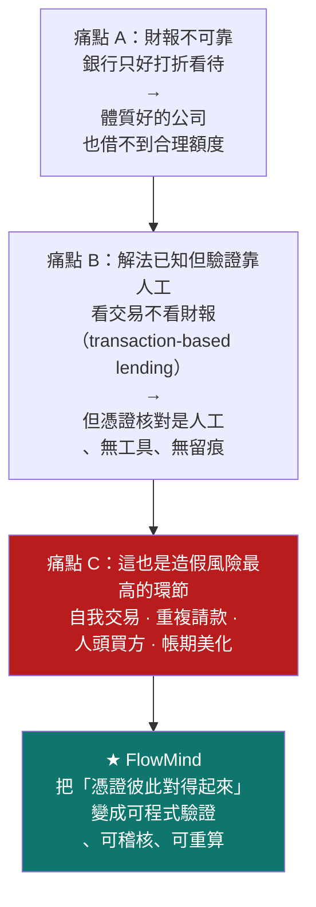
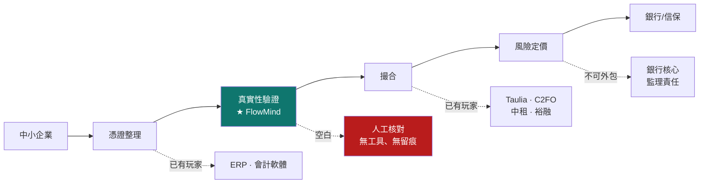
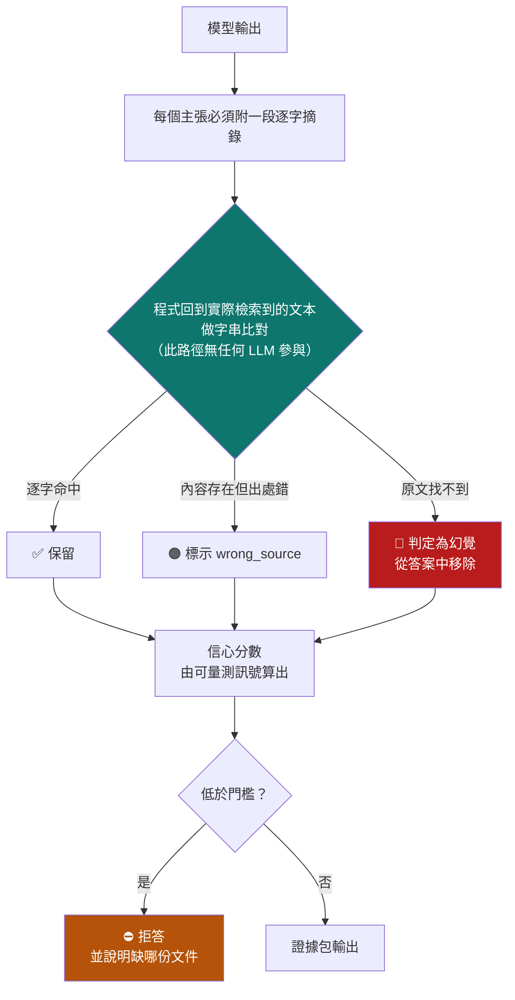
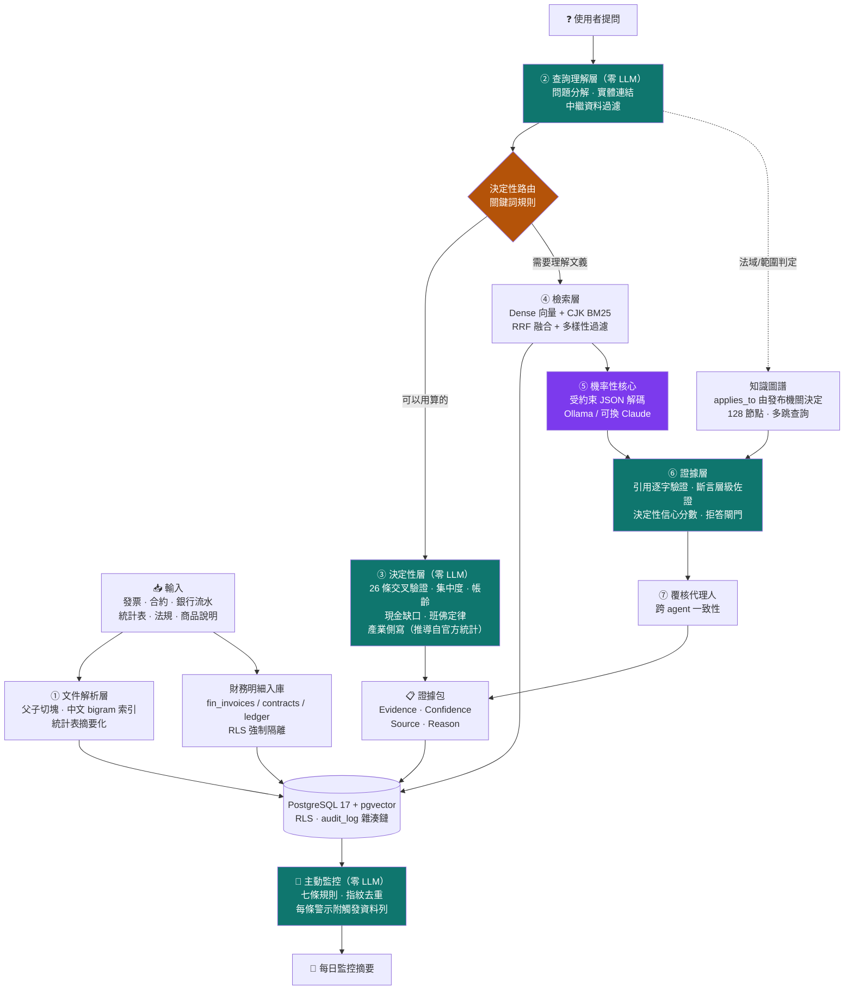
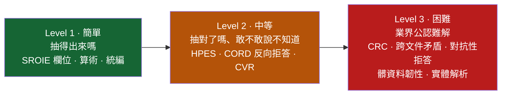
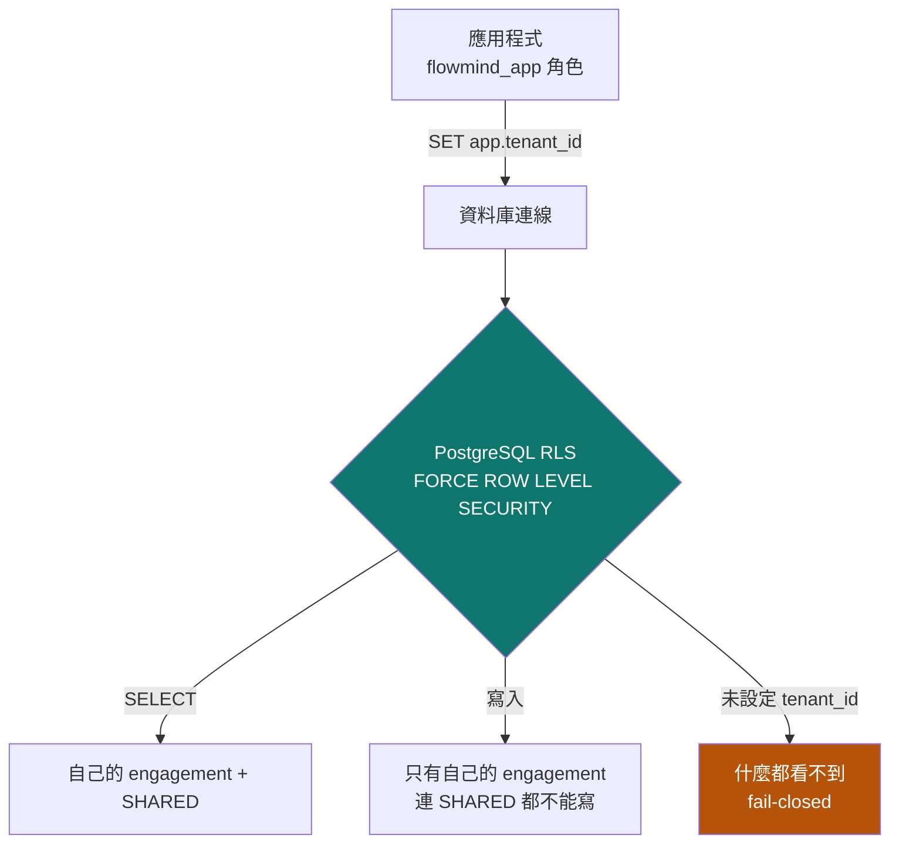
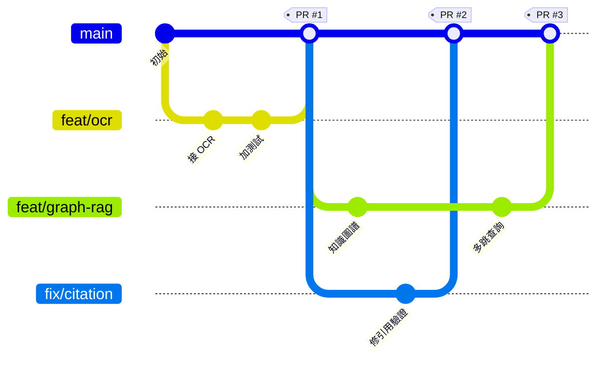

# FlowMind AI

**中小企業供應鏈融資的可驗證證據層（Verifiable Credit Evidence Layer）**

> 用**確定性的外殼**，包住**機率性的核心**——
> 讓中小企業的營運文件，變成銀行授信人員可以逐項驗證的證據包。

2026 台北金融科技獎｜金融創新獎—校園組

[]()
[]()
[]()
[]()

---

## 目錄

1. [一句話定位](#1-一句話定位)
2. [這個產品在解決什麼問題](#2-這個產品在解決什麼問題)
3. [核心主張：確定性外殼包住機率性核心](#3-核心主張確定性外殼包住機率性核心)
4. [系統架構](#4-系統架構)
5. [環境設定與執行方式](#5-環境設定與執行方式)
6. [核心技術決策與理由](#6-核心技術決策與理由)
7. [VeriFin：不可 gameable 的驗證指標](#7-verifin不可-gameable-的驗證指標)
8. [多委任案隔離](#8-多委任案隔離)
9. [資料來源：真實與合成的分工](#9-資料來源真實與合成的分工)
10. [目前表現與已知限制](#10-目前表現與已知限制)
11. [多人協作流程（Git / Branch）](#11-多人協作流程git--branch)
12. [專案結構](#12-專案結構)
13. [延伸文件](#13-延伸文件)

---

## 1. 一句話定位

> **AI 把企業的非結構化營運資料，自動轉換成銀行可以授信的金融資產。**

這不是我們想出來的說法。中小企業信用保證基金《供應商融資信用保證要點》寫著：

> 供應商憑中心廠商之**訂單、發票（含電子發票）、支票、預約付款通知
> 及其他經本基金同意得以佐證交易真實性之文件**撥貸。
> 信用保證成數最高**九成**；保證手續費年費率最低**百分之零點三七五**，
> 本基金得視……**實際送保逾期情形**，酌增。

制度已經寫明三件事：

1. **可以憑發票、訂單融資** — 不需修法、不需監理沙盒
2. **關鍵條件是「佐證交易真實性」** — 舉證責任在申請方
3. **費率會因送保品質浮動** — **證明能力越強，資金成本越低**

缺的從來不是制度，是「**怎麼有效率地證明交易是真的**」。FlowMind 做的就是這一段。

---

## 2. 這個產品在解決什麼問題

### 2.1 使用者與付費者不是同一個人

| | 中小企業財務／老闆 | **銀行企金 · 信保機構的授信人員** |
|---|---|---|
| 角色 | 使用者 | **付費者** |
| 痛點 | 送件被退、不知還缺什麼、來回數週 | 一疊 PDF 要人工核對，一案數十上百張憑證 |
| 願付意願 | 低（現金流本來就緊） | **高（人力成本可精算）** |

很多學生團隊死在這一格：做了對中小企業很友善的工具，然後發現中小企業不願付月費。
我們把商業重心放在右邊，中小企業端定位為**獲客管道**（免費的送件前自檢）。

### 2.2 產業痛點的具體形式



### 2.3 金融價值鏈定位



**不做撮合**（已有成熟玩家），**不做評分卡**（銀行核心、監理責任不外包）。
做中間那格被跳過的：**銀行不是不想借給中小企業，是驗證成本太高。**

---

## 3. 核心主張：確定性外殼包住機率性核心

### 3.1 為什麼「可驗證」比「更聰明」重要

大部分 RAG 產品的可解釋性，是請 LLM 在句尾寫上 `[來源: xxx.pdf]`。
問題是：**那串引用標籤本身也是模型生成的 token。**
模型可以在完全沒讀過那份文件的情況下，寫出格式完美的引用。
從畫面上，使用者分辨不出「有引用」和「有根據」的差別。



模型唯一能提高分數的方法，就是**真的去讀檢索到的文件**。

**引用可以用刪節號省略，但不能改寫。**
`「訂單、發票…得以佐證交易真實性之文件撥貸」` 這種學術慣例是允許的：
驗證器把刪節號前後拆成片段，要求**每段逐字命中且順序與原文一致**。
順序約束是必要的——少了它，模型可以從文件各處挑零碎詞句拼成原文從未表達過的話。

### 3.2 為什麼刻意用弱模型開發

> 強模型會**遮蔽**系統問題；弱模型會**暴露**它們。

| 弱模型暴露的問題 | 直接用強模型會怎樣 |
|---|---|
| `qwen3.5:9b` 吐 `<think>` 破壞 JSON | 強模型自動遵守格式，我們永遠不會加上 grammar-constrained decoding |
| 模型用刪節號縮短引用導致驗證失敗 | 強模型逐字引用，驗證器就帶著 bug 上線 |
| 模型把檔名多打一個空格 | 強模型不犯，但**真實生產環境的量化/降級模型會** |
| 24 chunk 灌爆 context 被靜默截斷 | 強模型 context 大，永遠不觸發，直到客戶文件變多 |

**harness engineering 的價值不是讓弱模型變強，
而是讓工程師看清楚自己的設計有多少地方是靠運氣。**

這也對應金融場域的現實：銀行不會讓客戶發票流出去給雲端 API。
能離線跑的模型就是比較弱——**我們的架構必須在弱模型上就成立。**

---

## 4. 系統架構



**設計原則：凡是有明確規則可以算的，就不要讓語言模型去猜。**
17 個核心模組中**只有 1 個呼叫 LLM**（`llm.py`）。這個比例本身就是架構主張。

綠色的四個層級全部零 LLM，而且各自有測試強制驗證這件事
（測試會讀模組原始碼，確認裡面沒有任何模型呼叫）——
「我們沒有用 LLM」這句話如果只是寫在文件裡，那就只是一句話。

### 4.1 主動監控：把被動問答變成主動秘書

系統原本要等人問才會動。`watchtower.py` 讓它在沒有人問的時候也會工作，
但「主動」很容易退化成「每天喊一樣的話」，然後使用者開始忽略所有警示 ——
包括真的那幾條。所以三條紀律寫死在實作裡：

| 紀律 | 為什麼 |
|---|---|
| **零 LLM** | 一個會編造警示的監控系統，比沒有監控更糟 |
| **每條警示附觸發它的實際資料列** | 警示不是一句紅字，是「這 3 張發票、這些金額、這些日期」 |
| **同一件事只喊一次**（指紋不含時間戳） | 含了時間戳去重就完全失效 —— 這是這類系統最常見的實作錯誤 |

再加一條：**規則執行失敗會變成 critical 警示，不會靜默吞掉。**
因為「監控沒報警」與「監控壞了」在畫面上長得一模一樣。

```powershell
python -c "from flowmind import watchtower; print(watchtower.render(watchtower.scan('CASE-9999')))"
```

詳細設計見 [`docs/SDD.md`](docs/SDD.md)。

---

## 5. 環境設定與執行方式

本專案在 **Linux 與 Windows 都能跑**。以下兩套指令等價，
選一套照做即可；後續章節的指令以 Linux 為主，
Windows 使用者把 `python` 換成 `.venv\Scripts\python.exe`、
路徑分隔改成 `\` 即可。

| | Linux / macOS | Windows |
|---|---|---|
| Shell | bash / zsh | PowerShell |
| 虛擬環境啟動 | `source .venv/bin/activate` | `.venv\Scripts\Activate.ps1` |
| 路徑分隔 | `/` | `\` |
| Docker | Docker Engine | Docker Desktop |

### 5.1 前置需求

| 元件 | 版本 | 為什麼需要 |
|---|---|---|
| Python | 3.11 | 用 `uv` 管理，不動系統既有 Python |
| Docker + Compose | 任意近期版本 | 只跑 PostgreSQL + pgvector |
| Ollama | 任意近期版本 | 本地推論；金融場域不外送資料 |
| Git | 任意 | — |

**硬體**：本專案的效能數字量測自 8GB VRAM 的環境。
`gemma4:26b`（17GB）在 8GB 顯存上會有 CPU/GPU 分流，
冷啟動約 124 秒、熱啟動約 9 秒。
16GB 以上顯存可完全載入，速度明顯較快。
**顯存不足不影響正確性，只影響速度** —— 所有正確性測試都不依賴 GPU。

### 5.2 一次性建置

<details open>
<summary><b>Linux / macOS</b></summary>

```bash
# ① 取得程式碼（放哪裡都可以，以下用 ~/flowmind-ai 為例）
git clone https://github.com/wajason/flowmind-ai.git ~/flowmind-ai
cd ~/flowmind-ai

# ② 建立虛擬環境（uv：https://docs.astral.sh/uv/）
curl -LsSf https://astral.sh/uv/install.sh | sh      # 若尚未安裝 uv
uv venv .venv --python 3.11
source .venv/bin/activate
uv pip install -r requirements.txt

# ③ 下載模型（約 18GB，一次即可）
ollama pull gemma4:26b      # 抽取 + 顧問
ollama pull bge-m3          # Embedding（1024 維）

# ④ 啟動向量資料庫（host port 5433，刻意避開系統既有的 5432）
docker compose up -d
docker compose ps           # 應顯示 healthy

# ⑤ 設定環境變數
cp .env.example .env

# ⑥ 環境自檢 —— 缺什麼它會直接告訴你
python -m flowmind.cli doctor
```

</details>

<details>
<summary><b>Windows（PowerShell）</b></summary>

```powershell
# ① 取得程式碼
git clone https://github.com/wajason/flowmind-ai.git flowmind-ai
cd flowmind-ai

# ② 建立虛擬環境
winget install --id=astral-sh.uv -e                  # 若尚未安裝 uv
uv venv .venv --python 3.11
.\.venv\Scripts\Activate.ps1
uv pip install -r requirements.txt

# ③ 下載模型（約 18GB，一次即可）
ollama pull gemma4:26b
ollama pull bge-m3

# ④ 啟動向量資料庫
docker compose up -d
docker compose ps

# ⑤ 設定環境變數
Copy-Item .env.example .env

# ⑥ 環境自檢
python -m flowmind.cli doctor
```

> **PowerShell 執行原則**：若 `Activate.ps1` 被擋，執行一次
> `Set-ExecutionPolicy -Scope CurrentUser RemoteSigned`。

</details>

`doctor` 全綠的樣子：

```
✅ Ollama 連線正常（14 個模型）
   ✅ 抽取模型 gemma4:26b   ✅ 向量模型 bge-m3
✅ PostgreSQL 連線正常（pgvector 0.8.6），SHARED 知識庫 6889 個 chunk
✅ 連線角色 flowmind_app 非 superuser，Row-Level Security 生效
✅ 稽核軌跡 10 筆，雜湊鏈完整
```

> **為什麼是 port 5433**：刻意避開 5432。你的電腦上很可能已有其他專案的
> PostgreSQL。`docker compose up` 撞 port 而失敗，是最沒必要的第一印象。
>
> **為什麼用 `flowmind_app` 而不是 `flowmind` 連線**：後者是 superuser，
> **會繞過 Row-Level Security**，隔離形同虛設。`doctor` 會檢查這一項。

### 5.3 建立資料

```powershell
# 公開知識庫（法規 · 信保基金要點 · 銀行商品說明）
python scripts\fetch_public_corpus.py
python data_update_finance.py --tenant SHARED --rebuild     # 約 40 分鐘（含大型白皮書）

# 真實企業交易資料（政府採購決標公告：真實統編/金額/日期）
python scripts\fetch_real_corpus.py --source pcc --industry-preset manufacturing --pages 2

# 示範委任案
python generate_synthetic_data.py --seed 42 --outdir data\raw\CASE-0001
python data_update_finance.py --tenant CASE-0001 --rebuild

# 負向對照組（刻意注入五項已知缺陷）
python generate_synthetic_data.py --seed 7 --inject-defects --outdir data\raw\CASE-9999
python data_update_finance.py --tenant CASE-9999 --rebuild
```

### 5.4 日常使用

```powershell
# 顧問問答（含證據包輸出）
python rag_query.py --tenant CASE-0001 -q "信保基金供應商融資的保證成數最高幾成？"
python rag_query.py --tenant CASE-0001                    # 互動模式
python rag_query.py --tenant CASE-0001 -q "…" --json      # 給下游系統串接
python rag_query.py --tenant CASE-0001 -q "…" --force-rag # 略過決定性路由做對照

# 決定性交叉驗證（零 LLM）
python -m flowmind.cli crosscheck --tenant CASE-0001
python -m flowmind.cli crosscheck --tenant CASE-9999 --against-answer-key

# 資料隔離與稽核證明
python rag_query.py --verify-isolation CASE-0001 CASE-9999
python rag_query.py --verify-audit
python -m flowmind.cli engagements
```

### 5.5 評測與測試

```powershell
# 回歸測試（163 項，數秒，不需資料庫與 LLM）
python tests\test_core.py

# 外部 benchmark
python scripts\fetch_benchmarks.py                        # SROIE / FUNSD / CORD
python scripts\run_verifin.py --suite sroie --limit 50
python scripts\run_verifin.py --suite all --limit 0 --counterfactual   # 正式數據

# 模型選型實測（6 模型 × 5 面向完整矩陣，約 25 分鐘）
python scripts\model_matrix.py
python scripts\model_matrix.py --models gemma4:26b qwen3.6:35b   # 只比特定模型
```

### 5.6 產生領域技能檔

```powershell
python skill_builder.py --tenant SHARED
# → out/skills/taiwan-supply-chain-finance/SKILL.md
```

產出符合 **Agent Skills 開放標準**（YAML frontmatter + Markdown），
可放進 `.claude/skills/`、也可餵給 Hermes / llama.cpp / Ollama 等任何執行環境
（見該目錄下的 `PORTING.md`）。

> ⚠️ 目前 skill_builder 的引用驗證率僅 **31.8%**，
> **人工覆核前不得對外交付**。原因與改善方向見 §10.3。

---

## 6. 核心技術決策與理由

### 6.1 中文稀疏檢索：不用 `to_tsvector('english', 中文)`

PostgreSQL 沒有內建中文分詞。對中文餵 english parser，會把整段中文吐成極少數超長 token：

- BM25 那一路幾乎永遠 0 命中
- Hybrid Retrieval 名義上雙路召回，實際退化成純向量單路
- **而 RRF 分數仍然算得出來、面板仍然亮綠燈**——所以「看起來正常」

代價很具體：「統一編號 84726193」「無追索權」這類必須逐字命中的關鍵詞，
正是稠密向量最不擅長、必須靠稀疏檢索補的部分。

解法是**字元 bigram**（Lucene 的 CJKAnalyzer 就是這樣做的），
不引入需要編譯的 `pg_jieba`/`zhparser`，維持「`docker compose up` 就能跑」的可重現性。

檢索面板的 **Sparse 貢獻**欄位是這個問題的長期偵測器——長期掛 0 就是分詞又壞了。

### 6.2 Embedding 走 Ollama 而不是 sentence-transformers

8GB VRAM 下，sentence-transformers 載入 bge-m3 固定佔約 2.4GB，
再載入 6.6GB 的 LLM 就超過顯存。Ollama 遇到顯存不足**不報錯**，
只會靜默退回部分 CPU 推論——表現是「突然慢 5~8 倍而且不知道為什麼」。

改成兩者都由 Ollama 管理後，顯存排程變成它的問題。
副作用：這個專案**完全不需要安裝 PyTorch**（省下約 2.5GB 與大量相依衝突）。

### 6.3 保留 LiteLLM 而不直接綁 Ollama SDK

換成 Claude API 或 Azure OpenAI 只需改 `.env` 三行，程式碼零修改。
對要進企業 POC 的產品，被單一模型供應商綁死是實質風險。

**例外**：需要設定 `num_ctx` 的長 context 合成走原生 API（`llm.chat_local()`）——
LiteLLM 的 OpenAI 相容端點無法傳遞這個參數，超長 prompt 會被**靜默截斷**。

### 6.4 結構化抽取用受約束解碼

`llm.extract_json()` 走 Ollama 原生 `format=<JSON Schema>`，
這是 **grammar-constrained decoding**：解碼時直接把不合法 JSON 的 token 機率壓成 0。
不是「請你只輸出 JSON，謝謝」然後寫正則去救——那在 demo 現場是定時炸彈。

### 6.5 模型選型

| 角色 | 模型 | 理由 |
|---|---|---|
| 抽取 + 顧問 | `gemma4:26b` | 唯一同時滿足三項硬需求、且 HPES 為正的非中資模型 |
| 離線合成 | 暫無 | 原定 `gpt-oss:20b`，本地檔案毀損且重抓受阻，如實記錄 |
| Embedding | `bge-m3` | 多語言、中英混雜金融文件穩定、1024 維 |

**關於顯存**：`gemma4:26b` 是 17GB，在 8GB 顯卡上必定大量溢出
（實測 `ollama ps` 顯示 74%/26% CPU/GPU）。
選型前我們預期這樣不可行，**但實測推翻了這個預期**：單次抽取仍只要 8~9 秒。

真正的問題不是溢出而是**冷啟動**：載入 17GB 要 **123.7 秒**，
而 Ollama 預設閒置 5 分鐘就卸載模型 ——
demo 中停下來講兩句話，下一題就要當著評審的面等兩分鐘。
因此 `flowmind/llm.py` 在每次請求都帶 `keep_alive`（預設 30m），
而不是依賴 `OLLAMA_KEEP_ALIVE` 環境變數 ——
後者要求 Ollama **服務啟動時**就帶著，在別人的機器上重現不了。

完整實測數據見 [`docs/MODEL_SELECTION.md`](docs/MODEL_SELECTION.md)。

---

## 7. VeriFin：不可 gameable 的驗證指標

### 7.1 為什麼現有評測不值得相信

| 方式 | 致命弱點 |
|---|---|
| LLM-as-judge | 獎勵「寫得像對的」。語氣篤定但錯誤的輸出，分數常高於誠實說「文件沒寫」 |
| 欄位準確率 / F1 | **猜永遠不虧**。理性最佳策略是全部都猜 |

### 7.2 四項指標

**① HPES（主指標）** — 答對 `+1`、留白 `0`、答錯 `−λ`（λ=2）

```
猜的期望分數   = p·1 + (1−p)·(−λ)
留白的期望分數 = 0
相等時 p = λ/(1+λ) = 0.667
```

除非真實把握超過 2/3，否則猜的期望分數低於留白。
這不是規則禁止亂猜，是讓亂猜**在數學上不划算**（proper scoring rule）。

**② CVR** — 引用可驗證率。純字串比對，模型無法用文采通過。

**③ CRC** — 反事實穩健度。把原文標準答案換成隨機新值，要求答案跟著改。
擾動值**評測當下才生成**，沒有模型能記住一個還不存在的數字。

**④ Risk-Coverage / AURC** — 自報信心可以灌水，但灌水會立刻毀掉曲線。
測的是信心有沒有**排序能力**。

**四項不合成單一總分**：合成分數是 benchmark 被玩壞的主因。

### 7.3 三層 Benchmark（簡／中／難）



完整測項、通過標準、目前狀態見 [`docs/SDD.md` §7](docs/SDD.md#7-benchmark-分層設計簡中難)。

### 7.4 三個外部 benchmark 的適用性（不是照單全收）

| 資料集 | 適用性 | 用法與理由 |
|---|---|---|
| **SROIE** | ★ 主要 | 提供 OCR 後的 `words`，可**單獨**評測「文字→欄位」，不被 OCR 好壞混淆 |
| **FUNSD** | ★ 次要 | 199 份高雜訊表單的鍵值配對，對應真實合約與對帳單 |
| **CORD** | ★ 反向 | 印尼零售收據，**反過來用**：問它 B2B 專屬欄位（統編、帳期），正確答案全是 null |

抽取分數可以靠多猜刷高，**拒答分數不行**。兩份考卷合起來才擋得住刷分。

---

## 8. 多委任案隔離



**為什麼不是在 SQL 加 `WHERE tenant_id`**：那是開發者自律。
一次 code review 疏漏就是跨客戶資料外洩。內控稽核不接受「我們程式碼有加過濾」。

用語採會計師事務所的 **engagement（委任案）** 而非 project：
一個客戶可能同時有多個 engagement，文件可見範圍綁在 engagement 上——
這是實務上隔離的最小單位。

**可執行的證明**（可以在評審面前跑）：

```powershell
python rag_query.py --verify-isolation CASE-0001 CASE-9999
```

它會：① 用 admin 確認對照組資料**確實存在**（避免「根本沒資料」的假通過）
② 以 CASE-0001 身分下**完全沒有 WHERE 條件**的 SQL，確認看不到
③ 嘗試寫入他人資料，確認被資料庫拒絕

結果分三態：`passed` / `failed` / `inconclusive`——
把「測試無效」誤報成「隔離失效」，在評審台上是會出事的。

---

## 9. 資料來源：真實與合成的分工

### 9.1 真實資料（可查證、合法、可程式取得）

| 來源 | 內容 | 用途 |
|---|---|---|
| **政府電子採購網決標公告** | 真實 B2B 交易：真實統編、金額、日期、履約期間 | 憑證結構與交叉比對的真實地基 |
| **SBA 7(a) FOIA（美國）** | 逐筆中小企業保證貸款，**含真實違約標籤** | 唯一可得的真實違約 ground truth |
| **全國法規資料庫** | 六部法規全文（發展條例、民法債編、營業稅法…） | RAG 引用的正式法源 |
| **信保基金保證要點** | 供應商融資、企業相對保證等要點全文 | 產品條件與制度依據 |
| **中小企業白皮書 · 29 份統計 CSV** | 市場規模、行業別、資金缺口 | 市場論證 |

實測抓取（`python scripts\fetch_real_corpus.py`）：

```
36 筆真實決標 · 29 家真實得標廠商 · 10 個招標機關
統編檢核碼通過率 86.1%   金額欄位覆蓋率 100%
真實決標金額：中位數 NT$5,305,844   區間 NT$190,000 ~ NT$59,900,000
```

> **那 13.9% 統編不通過的紀錄，是這份資料最有價值的部分。**
> 合成資料永遠 100% 乾淨。真實世界有機關代碼、外國廠商、聯合承攬體。
> **一個沒見過髒資料的系統，上線第一天就會壞。**

### 9.2 合成資料補的維度

私人買方信用風險、付款帳期與逾期行為、銀行流水勾稽、造假憑證負向對照組——
這四項真實公開資料補不上。合成資料的價值是**答案由建構方式決定**，
適合驗證邏輯正確性，**不能用來宣稱真實世界的準確率**。

### 9.3 誠實揭露的落差

1. 政府採購買方是政府機關，缺「買方信用風險」維度
2. SBA 是美國制度，違約率不可直接套用台灣
3. 兩者都不含發票影像，OCR 仍須靠 SROIE/FUNSD/CORD
4. 履約期間 ≠ 付款帳期

> 把限制寫清楚，比宣稱「我們有真實資料」更有說服力。

---

## 10. 目前表現與已知限制

### 10.1 實測快照

| 項目 | 結果 |
|---|---|
| 造假偵測（22 種樣態） | Recall **99.5%**（可偵測類）· Precision 68.6% · **MCC 0.819** |
| 50 題法規問答 | 整體通過 **78%**｜來源正確 88.9%｜事實正確 **93.9%**｜路由正確 **100%**｜引用率 **100%** |
| 引用可驗證率 CVR | **97.5%**（SROIE） |
| 憑空生成率 | **2.38%** |
| 嚴格 JSON 失敗率 | **0.0%** |
| **技能檔自我驗證** | 📗 逐字引用 **1/1**｜📊 實測數字 **13/13**｜未標記數字 **0 行** |
| 跨委任案隔離（文件） | **通過**（查詢語句無 `WHERE tenant_id`） |
| **跨委任案隔離（財務明細）** | **通過** —— 可見 tenant 數 = 1 |
| 認證鏈（authn） | 四情境全過：授權/未授權/偽造權杖/撤銷即時生效 |
| 稽核雜湊鏈 | 完整未斷鏈 |
| **端到端可重現性** | 安靜條件 **9/9 完全一致**；顯存競爭下**不一致**（見下） |
| 回歸測試 | **163 / 163** |
| 知識圖譜 | **128 節點**（83 文件 · 16 產業 · 11 期間 · 9 主題 · 9 法域） |
| 知識庫規模 | 83 份文件 / **7,619** chunks |

#### 兩個 bug 的完整帳：+22 個百分點，以及一個必須說清楚的代價

50 題評測從 56% 提升到 78%，全部來自**修 bug**，
沒有動任何門檻、權重或係數：

| | 起點 | 修檢索確定性後 | 再修 strip 後 |
|---|---|---|---|
| 整體通過率 | 56.0% | 60.0% | **78.0%** |
| 事實正確率 | 91.3% | 91.3% | **93.9%** |
| 引用率 | 100% | 100% | 100% |
| **過度保守題數** | 17 | 16 | **5** |
| **該拒答卻回答（安全關鍵）** | 2 | **1** | **2** |

**最後一列是代價，不能不講**：H02（問「玉山銀行的**實際核准利率**」，
這個數字不在任何公開文件裡）在中間那個版本被正確拒答，
修 strip 之後又被放行了。

但關鍵在於**它當初為什麼會被擋下來**：不是因為系統偵測到
「這題超出知識庫範圍」，而是因為模型剛好也掰了一句話、
觸發了幻覺上限。**那是碰巧擋到的，不是設計擋到的。**

用幻覺上限去攔截「超出範圍的問題」是巧合而非機制。
正確的攔截點是覆蓋率與範圍訊號。
**我們刻意不拿這 50 題去調那個閘門** —— 那就是資料洩漏，
調出來的門檻在真實資料上不會成立。
這一項列為已知限制，正確做法是用 held-out 的
`data/evalset/calibration_dev.jsonl` 重新校準。

#### 最重要的一個 bug：檢索層原本不可重現

這是評測 A/B 比較時撞出來的，而且比被測的項目嚴重得多：
**同一個 query 連跑四次，召回的 chunk 組合有四種。**

歸因過程，每一步都實測，不是猜的：

| 假設 | 實測 | 結論 |
|---|---|---|
| embedding 不穩定？ | 四次向量**位元完全相同**（逐維差 0.000e+00） | ❌ 不是模型的問題 |
| HNSW 近似搜尋？ | 改 `iterative_scan = strict_order` → **仍然不一致** | ❌ 不是主因 |
| **ORDER BY 不是全序？** | 補上 `id` 決勝鍵 → **四次完全一致** | ✅ **就是這個** |

最大的元凶是稀疏檢索那段：`ts_rank` 會產生大量相同分數，
`LIMIT 200` 取哪 200 筆在 SQL 語意上**本來就是未定義的**。

**為什麼這比「排序稍微不同」嚴重得多**：

1. 後段 chunk 一變，覆蓋率判定就可能翻面，
   信心分數在 **0.90 與 0.40（覆蓋率閘門上限）之間跳**。
   50 題評測 A/B 比較中 6 題通過狀態改變，**全部是這個原因**，
   與當時被測的修正完全無關 —— 我們差點把雜訊當成效果。
2. 稽核問「當初這個建議是根據哪幾份文件」時，重跑會給出不同的清單。
   **那個回答就不可信**，而可稽核性正是這個產品的核心主張。

修正後實測反而更快（2.35~3.99s vs 3.77~4.40s）。
測試新增「同一 query 三次同結果」與「三個排序都有決勝鍵」——
後者是**結構性保證**，少了它前者就只是擲骰子。

#### 另一個必須誠實揭露的發現：「T=0 所以可重現」是錯的

我們自己做的對照實驗（`scripts/check_answer_reproducibility.py`）：

| 條件 | 引用完整度 | 結論 |
|---|---|---|
| A 同一行程重複 3 次 | 0.667 / 0.667 / 0.667 | 一致 |
| B 每次開新行程 | 0.667 / 0.667 / 0.667 | 一致 |
| C 新行程 + 先跑一題暖身 | 0.667 / 0.667 / 0.667 | 一致 |
| **D 顯存競爭（另一模型同時常駐）** | **0.500** / 0.667 / 0.667 | **不一致** |

同一個模型、同一個 prompt、同一個 seed，**只要顯存壓力不同，中間指標就會不同**。
這正是 IBM 論文（arXiv:2511.07585）的核心論點 ——
非決定性來自**服務條件**，不是取樣溫度。這裡是在自己的系統上第一手複現。

**三個操作結論**：

1. 稽核用的可重現性**必須靠保存輸入輸出快照**，不能靠「重跑一次應該會一樣」
2. 出具正式意見的批次，**不得與其他模型共用顯存**
3. 本次四個條件下「是否拒答」的最終決定始終一致，但那是因為分數距離門檻夠遠 ——
   **貼著門檻的案例仍可能翻面**。不能拿「決定一致」當成「完全穩定」

這個發現也回頭改掉了我們的評測方法：模型矩陣現在**一次只跑一個模型**，
每個模型測試前清空其他常駐模型。原本並存著測，量到的延遲是資源競爭而不是模型本身，
更嚴重的是連準確率與漂移這兩項**硬需求**都被污染 ——
用被污染的數字淘汰模型，等於用錯的理由做對的決定。

### 10.2 模型選型：10 模型 × 5 面向（一次只跑一個模型）

三項硬需求**事先聲明**（不達標即淘汰），其餘為取捨：
嚴格 JSON 失敗率 0%｜位元級輸出漂移 100%｜繁體中文純度 100%。

| 模型 | 來源 | 位元漂移 | 準確率 | HPES | 留白 | 繁中純度 | 分級 |
|---|---|---|---|---|---|---|---|
| `granite4.1:8b` | IBM · 美國 | **100%** | 53.3% | −0.367 | 1 | 100% | T1 |
| `olmo2:7b` | AI2 · 美國 | 100% | 40.0% | −0.600 | 6 | 100% | T1 |
| `mistral` | Mistral · 法國 | **12%** | 46.7% | −0.400 | 6 | 99.69% ❌ | **T2** |
| `mistral-nemo` | Mistral · 法國 | 100% | 53.3% | +0.033 | 13 | **95.01%** ❌ | T1 |
| `vanilj/Phi-4` | Microsoft · 美國 | 100% | 50.0% | −0.333 | 5 | 100% | T1 |
| `gemma4:e4b` | Google · 美國 | 100% | 63.3% | −0.100 | 0 | 100% | T1 |
| **`gemma4:26b`** ← 選用 | Google · 美國 | **100%** | **70.0%** | **+0.100** | **0** | **100%** | **T1** |
| `llama3.2` | Meta · 美國 | **12%** | 38.3% | −0.717 | 4 | 100% | **T3** |
| `qwen3.5:9b` | Alibaba · 中國 | 100% | 33.3% | **+0.233** | **37** | **96.11%** ❌ | T1 |
| `qwen3.6:35b` | Alibaba · 中國 | 100% | 70.0% | +0.167 | 2 | 100% | T1 |

**依硬需求逐一淘汰後，只有 `gemma4:26b` 同時滿足三項硬需求、
HPES 為正、且非中資。**（`granite4.1`／`olmo2`／`Phi-4`／`gemma4:e4b`
硬需求全過但 HPES 為負；`qwen3.6:35b` 各項相當但為中資來源。）

四個發現：

1. **傳統準確率會選錯模型。** `gemma4:e4b` 準確率（63.3%）幾乎是
   `qwen3.5:9b`（33.3%）的兩倍，但它 60 個欄位留白 0 次，HPES 是負的。
   在授信場域，一個編造的統編比一個空欄位貴太多。
2. **但 HPES 也不能單獨看。** `qwen3.5:9b` 的 HPES **全場最高**（+0.233），
   卻留白 37 次、只回答 38% —— 對每題都留白的模型 HPES 恰好是 0，
   不難看卻毫無用處。**必須配留白率一起讀。**
3. **IBM 論文複現了一半，也推翻了一半。** 論文主張 (a) T=0 下仍會漂移、
   (b) 較小的模型較穩定。**(a) 成立，而且論文自家的 `granite4.1:8b`
   實測 100%，複現成功**；**(b) 不成立** —— 最不穩定的兩個
   （`llama3.2` 3B、`mistral` 7B）是最小的，最大的 `qwen3.6:35b` 反而 100%。
   規模與穩定性沒有可辨識的關係。**論文給的是方法，不是可照抄的答案。**
4. **非決定性來自服務條件，不是取樣溫度**（見下方兩個 bug 的完整帳）。

> **本表推翻了先前選 `qwen3.5:9b` 的決定**（繁中純度硬需求不達標）。
> 推翻的完整過程、逐一淘汰理由、以及「選非中資付出多少代價」的量化比較，
> 見 [`docs/MODEL_SELECTION.md`](docs/MODEL_SELECTION.md)。

> ⚠️ 樣本：漂移 8 次重複、SROIE 15 份文件 / 60 欄位、繁中純度 4 題。
> 足以支撐「相對排序」與「硬需求是否達標」，**不足以宣稱絕對準確率**。

### 10.3 已知限制（誠實揭露）

| 問題 | 現況 | 影響 |
|---|---|---|
| **超出範圍的問題靠幻覺上限「碰巧」擋下** | H02（問銀行的實際核准利率）修 bug 後又被放行 | **待用 held-out dev set 重新校準覆蓋率閘門，不可拿這 50 題調** |
| 仍有 5 題過度保守 | 信心 0.0～0.25，遠低於門檻 | 多為跨文件比較與流程類問題 |
| 沒有 OCR | 只吃 text-based PDF 與結構化檔案 | 掃描件無法處理 |
| Benchmark 域外 | SROIE/FUNSD/CORD 是英文/印尼文零售收據 | 中文 B2B 只有合成資料證據 |
| 8GB VRAM 瓶頸 | 冷啟動 123.7s、熱啟動 ~9s | 正式部署須改雲端或更大顯存 |
| 企業歷史層是介面 | 以合成資料展示接收與驗證能力 | 真實部署由客戶帶入 |
| 產業知識跨檔覆蓋 66.67% | 受僱人數統計把兩組產業併類 | 5 個產業缺該欄位（`coverage_report()` 可查） |
| Level 3 未完整 | 對抗性拒答、髒資料韌性、實體解析未實作 | 見 SDD §7 |

> **關於第一項**：H02 在中間版本被正確拒答，但那是因為模型剛好也掰了一句話、
> 觸發幻覺上限 —— **碰巧擋到，不是設計擋到**。
> 用幻覺上限攔截「超出範圍的問題」是巧合而非機制。
> 正確做法是強化覆蓋率與範圍訊號，而且**必須用 held-out 資料校準**；
> 拿這 50 題去調，調出來的門檻在真實資料上不會成立。
> 我們選擇如實揭露而不是把它調掉。

**skill_builder 為什麼比 rag_query 差**：任務性質不同。
`rag_query` 問窄問題、答案短，逐字引用最自然；
`skill_builder` 要跨文件整合與抽象化，模型會改寫、會歸納——這正是合成任務該做的事，
但它接著把改寫過的句子打上引號當引文用。**這是產品設計問題，不是模型能力問題。**

一份不列限制的技術文件，通常代表作者沒有真的用過自己的系統。

---

## 11. 多人協作流程（Git / Branch）

### 11.1 分支模型

我們用**簡化版 GitHub Flow**——不用 git-flow 的多層分支，
一個 3–6 人的競賽團隊用不上，只會增加合併衝突。



| 分支 | 用途 | 命名 |
|---|---|---|
| `main` | 永遠可執行、`tests/test_core.py` 永遠全過 | — |
| 功能 | 新功能 | `feat/<簡短英文>`　例：`feat/ocr-layer` |
| 修錯 | Bug | `fix/<簡短英文>`　例：`fix/citation-ellipsis` |
| 文件 | 只改文件 | `docs/<簡短英文>` |
| 實驗 | 不確定會不會留 | `exp/<簡短英文>` |

### 11.2 第一次加入專案

```bash
git clone https://github.com/wajason/flowmind-ai.git
cd flowmind-ai
uv venv .venv --python 3.11
source .venv/bin/activate            # Windows: .\.venv\Scripts\Activate.ps1
uv pip install -r requirements.txt
cp .env.example .env                 # Windows: Copy-Item .env.example .env
docker compose up -d
python -m flowmind.cli doctor        # 確認環境就緒
python tests/test_core.py            # 確認全部通過再開始改
```

### 11.3 日常開發循環

```powershell
# ① 從最新的 main 開分支
git switch main
git pull origin main
git switch -c feat/ocr-layer

# ② 改東西…然後隨時確認沒把既有功能弄壞
python tests\test_core.py

# ③ 提交（訊息用中文沒關係，但要說清楚「為什麼」而不只是「改了什麼」）
git add .
git commit -m "接入 OCR：掃描件現在也能進 pipeline

原本只吃 text-based PDF，掃描件直接被 extract_pdf 回傳空字串。
改用 PaddleOCR 作為 fallback，並在 metadata 標記 ocr_applied，
讓後續的引用驗證知道這段文字有 OCR 誤差、不該用嚴格比對。"

# ④ 推上去
git push -u origin feat/ocr-layer

# ⑤ 開 PR
gh pr create --title "接入 OCR 層" --body "解決 #12。已補 3 項測試。"
```

### 11.4 Code Review 檢查清單

在按下 Approve 前，這四項一定要看：

| # | 檢查 | 為什麼 |
|---|---|---|
| 1 | `python tests\test_core.py` 是否 39/39 全過 | 核心邏輯不能退步 |
| 2 | 有沒有新的 SQL 直接寫 `WHERE tenant_id` | 隔離應由 RLS 負責，手寫過濾是反模式 |
| 3 | 有沒有在 `crosscheck.py` / `metrics.py` 裡呼叫 LLM | 這兩個模組必須維持零 LLM |
| 4 | 新增的宣稱有沒有對應的測試或實測數字 | 文件裡的數字必須可重跑驗證 |

### 11.5 常用指令速查

```powershell
git status                          # 現在改了什麼
git switch main                     # 切回主線
git switch -c feat/xxx              # 開新分支
git pull origin main                # 同步主線
git log --oneline --graph -15       # 看分支歷史

# 主線有更新，把我的分支接到最新的 main 上
git switch feat/xxx
git rebase main                     # 衝突時：改完後 git add . && git rebase --continue

git stash                           # 暫存未完成的修改
git stash pop                       # 取回

git restore <檔案>                  # 放棄某檔案的修改
git restore --staged <檔案>         # 從暫存區移除但保留修改

gh pr list                          # 看有哪些 PR
gh pr checkout 12                   # 把別人的 PR 抓下來測
gh pr create                        # 開 PR
```

### 11.6 絕對不要提交的東西

`.gitignore` 已設定，但仍請確認：

| 不可提交 | 原因 |
|---|---|
| `.env` | 含資料庫密碼與 API 金鑰 |
| `data/raw/CASE-*/` | **客戶的發票、合約、銀行流水屬於營業秘密**，誤推上 GitHub 就收不回來 |
| `data/processed/` · `out/` | 衍生產物，可重新產生 |
| `.venv/` | 環境，各人自建 |

只有 `data/raw/SHARED/`（政府與行庫公開資料）例外放行。

```powershell
# 推之前養成習慣先看一眼
git status
git diff --cached --stat
```

---

## 12. 專案結構

```
flowmind_AI/
├── flowmind/                    核心套件（11 模組，只有 llm.py 呼叫 LLM）
│   ├── config.py                單一設定來源
│   ├── textnorm.py              中文 bigram · 統編檢核碼 · 簡轉繁
│   ├── db.py                    RLS 感知連線 · 稽核鏈 · 隔離證明
│   ├── embeddings.py            可抽換向量化後端
│   ├── llm.py                   角色分工 · 受約束 JSON · 長 context 路徑
│   ├── retrieval.py             Hybrid Search + RRF + 多樣性過濾
│   ├── evidence.py              引用驗證 · 信心分數 · 拒答閘門
│   ├── crosscheck.py            決定性交叉驗證（零 LLM）
│   ├── metrics.py               決定性指標 + 問題路由
│   ├── verifin.py               不可 gameable 的評測指標
│   └── cli.py                   crosscheck / engagements / doctor
├── scripts/
│   ├── fetch_public_corpus.py   法規 · 信保基金 · 銀行商品
│   ├── fetch_real_corpus.py     真實企業交易（政府採購 · SBA）
│   ├── fetch_benchmarks.py      SROIE / FUNSD / CORD
│   ├── run_verifin.py           評測執行器
│   └── eval_models.py           模型選型實測
├── tests/test_core.py           163 項回歸測試（無外部依賴）
├── sql/init/                    RLS policy 與 schema
├── docs/
│   ├── SDD.md                   軟體設計規格書
│   ├── MODEL_SELECTION.md       模型選型實測數據
│   └── BUSINESS_CASE.md         商業論證與 demo 劇本
├── data/raw/<engagement>/       各委任案原始文件（互相隔離）
├── generate_synthetic_data.py   合成營運資料（含負向對照組）
├── data_update_finance.py       入庫 pipeline
├── rag_query.py                 顧問查詢介面
├── skill_builder.py             領域技能檔合成
└── docker-compose.yml           pgvector
```

---

## 13. 延伸文件

| 文件 | 內容 |
|---|---|
| [`docs/SDD.md`](docs/SDD.md) | 軟體設計規格書：架構、資料模型、三層 benchmark、業界未解難題、Roadmap |
| [`docs/MODEL_SELECTION.md`](docs/MODEL_SELECTION.md) | 模型選型的實測數據與判讀 |
| [`docs/BUSINESS_CASE.md`](docs/BUSINESS_CASE.md) | 目標用戶、商業模式、競爭定位、（略） |
| [`交接檔案_v4.md`](交接檔案_v4.md) | 接手指南：現況、四個關鍵發現、下一步 |

---

*本專案為競賽與研究用途。所引用之公開資料著作權歸各原始機關所有。*
*系統產出不構成授信、投資或財務建議，任何對外提出的融資建議須由授信權責人員覆核。*
