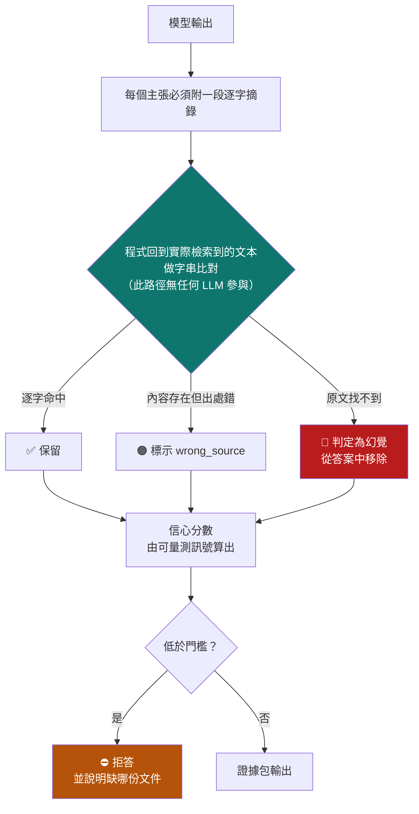
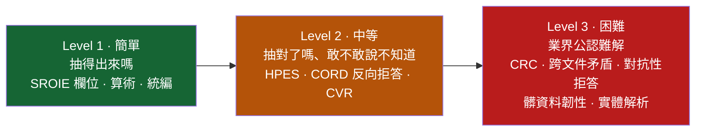
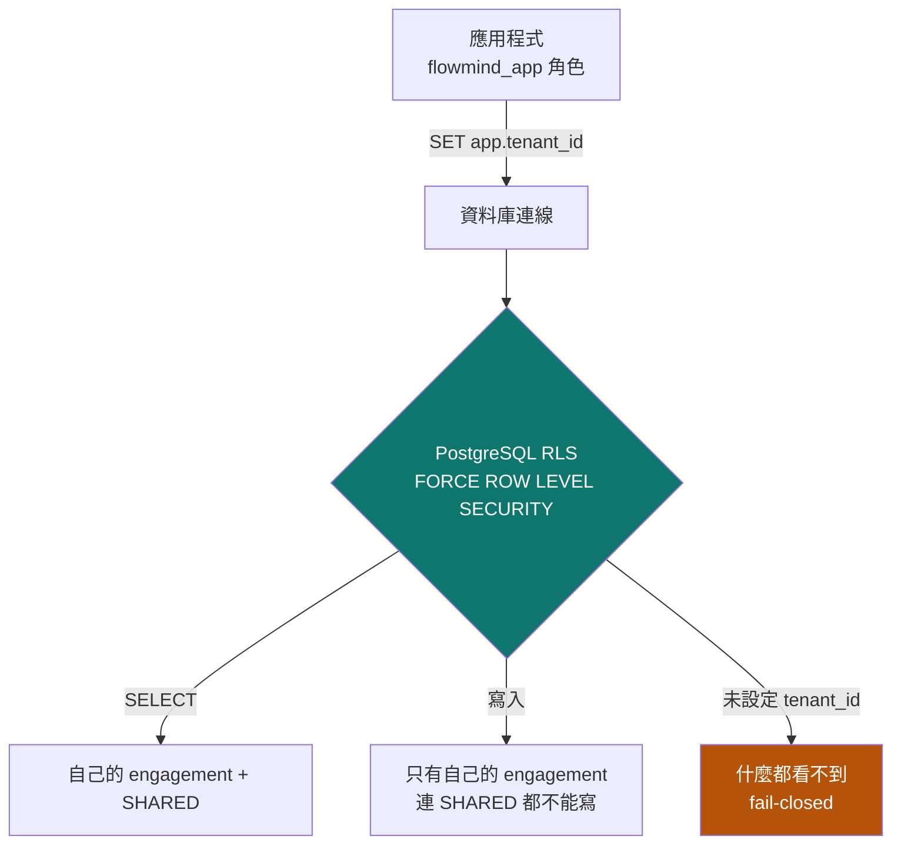

# 工程筆記：技術決策與踩過的坑

這份文件記錄幾個不寫下來就會被重新踩一次的決策。每一項都有實測依據，指令可在 [DEMO_RESULTS.md](DEMO_RESULTS.md) 找到。

## 1. 為什麼「可驗證」比「更聰明」重要

大部分 RAG 產品的可解釋性，是請 LLM 在句尾寫上 `[來源: xxx.pdf]`。
問題是：**那串引用標籤本身也是模型生成的 token。**
模型可以在完全沒讀過那份文件的情況下，寫出格式完美的引用。
從畫面上，使用者分辨不出「有引用」和「有根據」的差別。



模型唯一能提高分數的方法，就是**真的去讀檢索到的文件**。

**引用可以用刪節號省略，但不能改寫。**
`「訂單、發票…得以佐證交易真實性之文件撥貸」` 這種學術慣例是允許的：
驗證器把刪節號前後拆成片段，要求**每段逐字命中且順序與原文一致**。
順序約束是必要的——少了它，模型可以從文件各處挑零碎詞句拼成原文從未表達過的話。

## 2. 為什麼刻意用弱模型開發

> 強模型會**遮蔽**系統問題；弱模型會**暴露**它們。

| 弱模型暴露的問題 | 直接用強模型會怎樣 |
|---|---|
| `qwen3.5:9b` 吐 `<think>` 破壞 JSON | 強模型自動遵守格式，我們永遠不會加上 grammar-constrained decoding |
| 模型用刪節號縮短引用導致驗證失敗 | 強模型逐字引用，驗證器就帶著 bug 上線 |
| 模型把檔名多打一個空格 | 強模型不犯，但**真實生產環境的量化/降級模型會** |
| 24 chunk 灌爆 context 被靜默截斷 | 強模型 context 大，永遠不觸發，直到客戶文件變多 |

**harness engineering 的價值不是讓弱模型變強，
而是讓工程師看清楚自己的設計有多少地方是靠運氣。**

這也對應金融場域的現實：銀行不會讓客戶發票流出去給雲端 API。
能離線跑的模型就是比較弱——**我們的架構必須在弱模型上就成立。**

---

## 3. 主動監控的三條紀律

系統原本要等人問才會動。`watchtower.py` 讓它在沒有人問的時候也會工作，
但「主動」很容易退化成「每天喊一樣的話」，然後使用者開始忽略所有警示 ——
包括真的那幾條。所以三條紀律寫死在實作裡：

| 紀律 | 為什麼 |
|---|---|
| **零 LLM** | 一個會編造警示的監控系統，比沒有監控更糟 |
| **每條警示附觸發它的實際資料列** | 警示不是一句紅字，是「這 3 張發票、這些金額、這些日期」 |
| **同一件事只喊一次**（指紋不含時間戳） | 含了時間戳去重就完全失效 —— 這是這類系統最常見的實作錯誤 |

再加一條：**規則執行失敗會變成 critical 警示，不會靜默吞掉。**
因為「監控沒報警」與「監控壞了」在畫面上長得一模一樣。

```powershell
python -c "from flowmind import watchtower; print(watchtower.render(watchtower.scan('CASE-9999')))"
```

詳細設計見 [SDD.md](SDD.md)。

---

## 4. 核心技術決策

### 4.1 中文稀疏檢索：不用 `to_tsvector('english', 中文)`

PostgreSQL 沒有內建中文分詞。對中文餵 english parser，會把整段中文吐成極少數超長 token：

- BM25 那一路幾乎永遠 0 命中
- Hybrid Retrieval 名義上雙路召回，實際退化成純向量單路
- **而 RRF 分數仍然算得出來、面板仍然亮綠燈**——所以「看起來正常」

代價很具體：「統一編號 84726193」「無追索權」這類必須逐字命中的關鍵詞，
正是稠密向量最不擅長、必須靠稀疏檢索補的部分。

解法是**字元 bigram**（Lucene 的 CJKAnalyzer 就是這樣做的），
不引入需要編譯的 `pg_jieba`/`zhparser`，維持「`docker compose up` 就能跑」的可重現性。

檢索面板的 **Sparse 貢獻**欄位是這個問題的長期偵測器——長期掛 0 就是分詞又壞了。

### 4.2 Embedding 走 Ollama 而不是 sentence-transformers

8GB VRAM 下，sentence-transformers 載入 bge-m3 固定佔約 2.4GB，
再載入 6.6GB 的 LLM 就超過顯存。Ollama 遇到顯存不足**不報錯**，
只會靜默退回部分 CPU 推論——表現是「突然慢 5~8 倍而且不知道為什麼」。

改成兩者都由 Ollama 管理後，顯存排程變成它的問題。
副作用：這個專案**完全不需要安裝 PyTorch**（省下約 2.5GB 與大量相依衝突）。

### 4.3 保留 LiteLLM 而不直接綁 Ollama SDK

換成 Claude API 或 Azure OpenAI 只需改 `.env` 三行，程式碼零修改。
對要進企業 POC 的產品，被單一模型供應商綁死是實質風險。

**例外**：需要設定 `num_ctx` 的長 context 合成走原生 API（`llm.chat_local()`）——
LiteLLM 的 OpenAI 相容端點無法傳遞這個參數，超長 prompt 會被**靜默截斷**。

### 4.4 結構化抽取用受約束解碼

`llm.extract_json()` 走 Ollama 原生 `format=<JSON Schema>`，
這是 **grammar-constrained decoding**：解碼時直接把不合法 JSON 的 token 機率壓成 0。
不是「請你只輸出 JSON，謝謝」然後寫正則去救——那在正式環境是定時炸彈。

### 4.5 模型選型

| 角色 | 模型 | 理由 |
|---|---|---|
| 抽取 + 顧問 | `gemma4:26b` | 唯一同時滿足三項硬需求、且 HPES 為正的非中資模型 |
| 離線合成 | 暫無 | 原定 `gpt-oss:20b`，本地檔案毀損且重抓受阻，如實記錄 |
| Embedding | `bge-m3` | 多語言、中英混雜金融文件穩定、1024 維 |

**關於顯存**：`gemma4:26b` 是 17GB，在 8GB 顯卡上必定大量溢出
（實測 `ollama ps` 顯示 74%/26% CPU/GPU）。
選型前我們預期這樣不可行，**但實測推翻了這個預期**：單次抽取仍只要 8~9 秒。

真正的問題不是溢出而是**冷啟動**：載入 17GB 要 **123.7 秒**，
而 Ollama 預設閒置 5 分鐘就卸載模型 ——
操作中只要停下來兩三分鐘，下一題就要等兩分鐘。
因此 `flowmind/llm.py` 在每次請求都帶 `keep_alive`（預設 30m），
而不是依賴 `OLLAMA_KEEP_ALIVE` 環境變數 ——
後者要求 Ollama **服務啟動時**就帶著，換一台機器就重現不了。

完整實測數據見 [MODEL_SELECTION.md](MODEL_SELECTION.md)。

---

## 5. VeriFin：不可 gameable 的驗證指標

### 5.1 為什麼現有評測不值得相信

| 方式 | 致命弱點 |
|---|---|
| LLM-as-judge | 獎勵「寫得像對的」。語氣篤定但錯誤的輸出，分數常高於誠實說「文件沒寫」 |
| 欄位準確率 / F1 | **猜永遠不虧**。理性最佳策略是全部都猜 |

### 5.2 四項指標

**① HPES（主指標）** — 答對 `+1`、留白 `0`、答錯 `−λ`（λ=2）

```
猜的期望分數   = p·1 + (1−p)·(−λ)
留白的期望分數 = 0
相等時 p = λ/(1+λ) = 0.667
```

除非真實把握超過 2/3，否則猜的期望分數低於留白。
這不是規則禁止亂猜，是讓亂猜**在數學上不划算**（proper scoring rule）。

**② CVR** — 引用可驗證率。純字串比對，模型無法用文采通過。

**③ CRC** — 反事實穩健度。把原文標準答案換成隨機新值，要求答案跟著改。
擾動值**評測當下才生成**，沒有模型能記住一個還不存在的數字。

**④ Risk-Coverage / AURC** — 自報信心可以灌水，但灌水會立刻毀掉曲線。
測的是信心有沒有**排序能力**。

**四項不合成單一總分**：合成分數是 benchmark 被玩壞的主因。

### 5.3 三層 Benchmark（簡／中／難）



完整測項、通過標準、目前狀態見 [SDD.md §7](SDD.md#7-benchmark-分層設計簡中難)。

### 5.4 三個外部 benchmark 的適用性（不是照單全收）

| 資料集 | 適用性 | 用法與理由 |
|---|---|---|
| **SROIE** | ★ 主要 | 提供 OCR 後的 `words`，可**單獨**評測「文字→欄位」，不被 OCR 好壞混淆 |
| **FUNSD** | ★ 次要 | 199 份高雜訊表單的鍵值配對，對應真實合約與對帳單 |
| **CORD** | ★ 反向 | 印尼零售收據，**反過來用**：問它 B2B 專屬欄位（統編、帳期），正確答案全是 null |

抽取分數可以靠多猜刷高，**拒答分數不行**。兩份考卷合起來才擋得住刷分。

---

## 6. 多委任案隔離



**為什麼不是在 SQL 加 `WHERE tenant_id`**：那是開發者自律。
一次 code review 疏漏就是跨客戶資料外洩。內控稽核不接受「我們程式碼有加過濾」。

用語採會計師事務所的 **engagement（委任案）** 而非 project：
一個客戶可能同時有多個 engagement，文件可見範圍綁在 engagement 上——
這是實務上隔離的最小單位。

**可執行的證明**：

```powershell
python rag_query.py --verify-isolation CASE-0001 CASE-9999
```

它會：① 用 admin 確認對照組資料**確實存在**（避免「根本沒資料」的假通過）
② 以 CASE-0001 身分下**完全沒有 WHERE 條件**的 SQL，確認看不到
③ 嘗試寫入他人資料，確認被資料庫拒絕

結果分三態：`passed` / `failed` / `inconclusive`——
把「測試無效」誤報成「隔離失效」，會讓人做出錯誤判斷。

---

## 7. 兩個 bug 的完整帳

50 題評測從 56% 提升到 78%，全部來自**修 bug**，
沒有動任何門檻、權重或係數：

| | 起點 | 修檢索確定性後 | 再修 strip 後 |
|---|---|---|---|
| 整體通過率 | 56.0% | 60.0% | **78.0%** |
| 事實正確率 | 91.3% | 91.3% | **93.9%** |
| 引用率 | 100% | 100% | 100% |
| **過度保守題數** | 17 | 16 | **5** |
| **該拒答卻回答（安全關鍵）** | 2 | **1** | **2** |

**最後一列是代價，不能不講**：H02（問「玉山銀行的**實際核准利率**」，
這個數字不在任何公開文件裡）在中間那個版本被正確拒答，
修 strip 之後又被放行了。

但關鍵在於**它當初為什麼會被擋下來**：不是因為系統偵測到
「這題超出知識庫範圍」，而是因為模型剛好也掰了一句話、
觸發了幻覺上限。**那是碰巧擋到的，不是設計擋到的。**

用幻覺上限去攔截「超出範圍的問題」是巧合而非機制。
正確的攔截點是覆蓋率與範圍訊號。
**我們刻意不拿這 50 題去調那個閘門** —— 那就是資料洩漏，
調出來的門檻在真實資料上不會成立。
這一項列為已知限制，正確做法是用 held-out 的
`data/evalset/calibration_dev.jsonl` 重新校準。

#### 最重要的一個 bug：檢索層原本不可重現

這是評測 A/B 比較時撞出來的，而且比被測的項目嚴重得多：
**同一個 query 連跑四次，召回的 chunk 組合有四種。**

歸因過程，每一步都實測，不是猜的：

| 假設 | 實測 | 結論 |
|---|---|---|
| embedding 不穩定？ | 四次向量**位元完全相同**（逐維差 0.000e+00） | ❌ 不是模型的問題 |
| HNSW 近似搜尋？ | 改 `iterative_scan = strict_order` → **仍然不一致** | ❌ 不是主因 |
| **ORDER BY 不是全序？** | 補上 `id` 決勝鍵 → **四次完全一致** | ✅ **就是這個** |

最大的元凶是稀疏檢索那段：`ts_rank` 會產生大量相同分數，
`LIMIT 200` 取哪 200 筆在 SQL 語意上**本來就是未定義的**。

**為什麼這比「排序稍微不同」嚴重得多**：

1. 後段 chunk 一變，覆蓋率判定就可能翻面，
   信心分數在 **0.90 與 0.40（覆蓋率閘門上限）之間跳**。
   50 題評測 A/B 比較中 6 題通過狀態改變，**全部是這個原因**，
   與當時被測的修正完全無關 —— 我們差點把雜訊當成效果。
2. 稽核問「當初這個建議是根據哪幾份文件」時，重跑會給出不同的清單。
   **那個回答就不可信**，而可稽核性正是這個產品的核心主張。

修正後實測反而更快（2.35~3.99s vs 3.77~4.40s）。
測試新增「同一 query 三次同結果」與「三個排序都有決勝鍵」——
後者是**結構性保證**，少了它前者就只是擲骰子。

#### 另一個必須誠實揭露的發現：「T=0 所以可重現」是錯的

我們自己做的對照實驗（`scripts/check_answer_reproducibility.py`）：

| 條件 | 引用完整度 | 結論 |
|---|---|---|
| A 同一行程重複 3 次 | 0.667 / 0.667 / 0.667 | 一致 |
| B 每次開新行程 | 0.667 / 0.667 / 0.667 | 一致 |
| C 新行程 + 先跑一題暖身 | 0.667 / 0.667 / 0.667 | 一致 |
| **D 顯存競爭（另一模型同時常駐）** | **0.500** / 0.667 / 0.667 | **不一致** |

同一個模型、同一個 prompt、同一個 seed，**只要顯存壓力不同，中間指標就會不同**。
這正是 IBM 論文（arXiv:2511.07585）的核心論點 ——
非決定性來自**服務條件**，不是取樣溫度。這裡是在自己的系統上第一手複現。

**三個操作結論**：

1. 稽核用的可重現性**必須靠保存輸入輸出快照**，不能靠「重跑一次應該會一樣」
2. 出具正式意見的批次，**不得與其他模型共用顯存**
3. 本次四個條件下「是否拒答」的最終決定始終一致，但那是因為分數距離門檻夠遠 ——
   **貼著門檻的案例仍可能翻面**。不能拿「決定一致」當成「完全穩定」

這個發現也回頭改掉了我們的評測方法：模型矩陣現在**一次只跑一個模型**，
每個模型測試前清空其他常駐模型。原本並存著測，量到的延遲是資源競爭而不是模型本身，
更嚴重的是連準確率與漂移這兩項**硬需求**都被污染 ——
用被污染的數字淘汰模型，等於用錯的理由做對的決定。

## 8. 模型選型：10 模型 × 5 面向

三項硬需求**事先聲明**（不達標即淘汰），其餘為取捨：
嚴格 JSON 失敗率 0%｜位元級輸出漂移 100%｜繁體中文純度 100%。

| 模型 | 來源 | 位元漂移 | 準確率 | HPES | 留白 | 繁中純度 | 分級 |
|---|---|---|---|---|---|---|---|
| `granite4.1:8b` | IBM · 美國 | **100%** | 53.3% | −0.367 | 1 | 100% | T1 |
| `olmo2:7b` | AI2 · 美國 | 100% | 40.0% | −0.600 | 6 | 100% | T1 |
| `mistral` | Mistral · 法國 | **12%** | 46.7% | −0.400 | 6 | 99.69% ❌ | **T2** |
| `mistral-nemo` | Mistral · 法國 | 100% | 53.3% | +0.033 | 13 | **95.01%** ❌ | T1 |
| `vanilj/Phi-4` | Microsoft · 美國 | 100% | 50.0% | −0.333 | 5 | 100% | T1 |
| `gemma4:e4b` | Google · 美國 | 100% | 63.3% | −0.100 | 0 | 100% | T1 |
| **`gemma4:26b`** ← 選用 | Google · 美國 | **100%** | **70.0%** | **+0.100** | **0** | **100%** | **T1** |
| `llama3.2` | Meta · 美國 | **12%** | 38.3% | −0.717 | 4 | 100% | **T3** |
| `qwen3.5:9b` | Alibaba · 中國 | 100% | 33.3% | **+0.233** | **37** | **96.11%** ❌ | T1 |
| `qwen3.6:35b` | Alibaba · 中國 | 100% | 70.0% | +0.167 | 2 | 100% | T1 |

**依硬需求逐一淘汰後，只有 `gemma4:26b` 同時滿足三項硬需求、
HPES 為正、且非中資。**（`granite4.1`／`olmo2`／`Phi-4`／`gemma4:e4b`
硬需求全過但 HPES 為負；`qwen3.6:35b` 各項相當但為中資來源。）

四個發現：

1. **傳統準確率會選錯模型。** `gemma4:e4b` 準確率（63.3%）幾乎是
   `qwen3.5:9b`（33.3%）的兩倍，但它 60 個欄位留白 0 次，HPES 是負的。
   在授信場域，一個編造的統編比一個空欄位貴太多。
2. **但 HPES 也不能單獨看。** `qwen3.5:9b` 的 HPES **全場最高**（+0.233），
   卻留白 37 次、只回答 38% —— 對每題都留白的模型 HPES 恰好是 0，
   不難看卻毫無用處。**必須配留白率一起讀。**
3. **IBM 論文複現了一半，也推翻了一半。** 論文主張 (a) T=0 下仍會漂移、
   (b) 較小的模型較穩定。**(a) 成立，而且論文自家的 `granite4.1:8b`
   實測 100%，複現成功**；**(b) 不成立** —— 最不穩定的兩個
   （`llama3.2` 3B、`mistral` 7B）是最小的，最大的 `qwen3.6:35b` 反而 100%。
   規模與穩定性沒有可辨識的關係。**論文給的是方法，不是可照抄的答案。**
4. **非決定性來自服務條件，不是取樣溫度**（見下方兩個 bug 的完整帳）。

> **本表推翻了先前選 `qwen3.5:9b` 的決定**（繁中純度硬需求不達標）。
> 推翻的完整過程、逐一淘汰理由、以及「選非中資付出多少代價」的量化比較，
> 見 [MODEL_SELECTION.md](MODEL_SELECTION.md)。

> ⚠️ 樣本：漂移 8 次重複、SROIE 15 份文件 / 60 欄位、繁中純度 4 題。
> 足以支撐「相對排序」與「硬需求是否達標」，**不足以宣稱絕對準確率**。

## 9. 已知限制

| 問題 | 現況 | 影響 |
|---|---|---|
| **超出範圍的問題靠幻覺上限「碰巧」擋下** | H02（問銀行的實際核准利率）修 bug 後又被放行 | **待用 held-out dev set 重新校準覆蓋率閘門，不可拿這 50 題調** |
| 仍有 5 題過度保守 | 信心 0.0～0.25，遠低於門檻 | 多為跨文件比較與流程類問題 |
| 沒有 OCR | 只吃 text-based PDF 與結構化檔案 | 掃描件無法處理 |
| Benchmark 域外 | SROIE/FUNSD/CORD 是英文/印尼文零售收據 | 中文 B2B 只有合成資料證據 |
| 8GB VRAM 瓶頸 | 冷啟動 123.7s、熱啟動 ~9s | 正式部署須改雲端或更大顯存 |
| 企業歷史層是介面 | 以合成資料展示接收與驗證能力 | 真實部署由客戶帶入 |
| 產業知識跨檔覆蓋 66.67% | 受僱人數統計把兩組產業併類 | 5 個產業缺該欄位（`coverage_report()` 可查） |
| Level 3 未完整 | 對抗性拒答、髒資料韌性、實體解析未實作 | 見 [SDD.md §7](SDD.md) |

> **關於第一項（超出範圍的問題）**：H02 在中間版本被正確拒答，但那是因為模型剛好也掰了一句話、
> 觸發幻覺上限 —— **碰巧擋到，不是設計擋到**。
> 用幻覺上限攔截「超出範圍的問題」是巧合而非機制。
> 正確做法是強化覆蓋率與範圍訊號，而且**必須用 held-out 資料校準**；
> 拿這 50 題去調，調出來的門檻在真實資料上不會成立。
> 我們選擇如實揭露而不是把它調掉。

**skill_builder 為什麼比 rag_query 差**：任務性質不同。
`rag_query` 問窄問題、答案短，逐字引用最自然；
`skill_builder` 要跨文件整合與抽象化，模型會改寫、會歸納——這正是合成任務該做的事，
但它接著把改寫過的句子打上引號當引文用。**這是產品設計問題，不是模型能力問題。**


---
