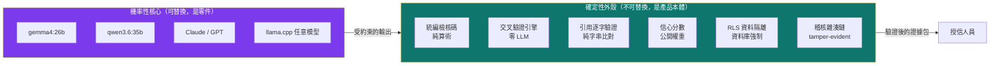
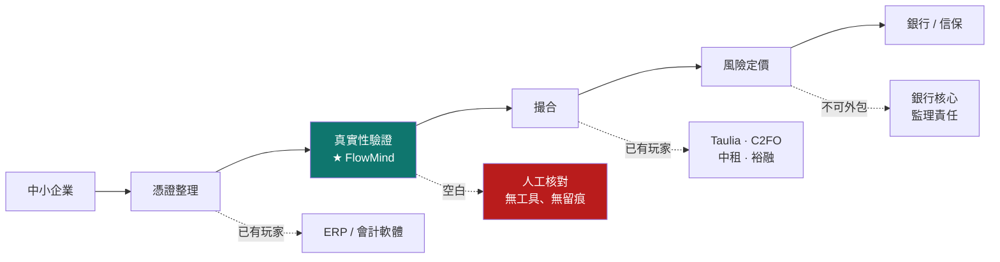
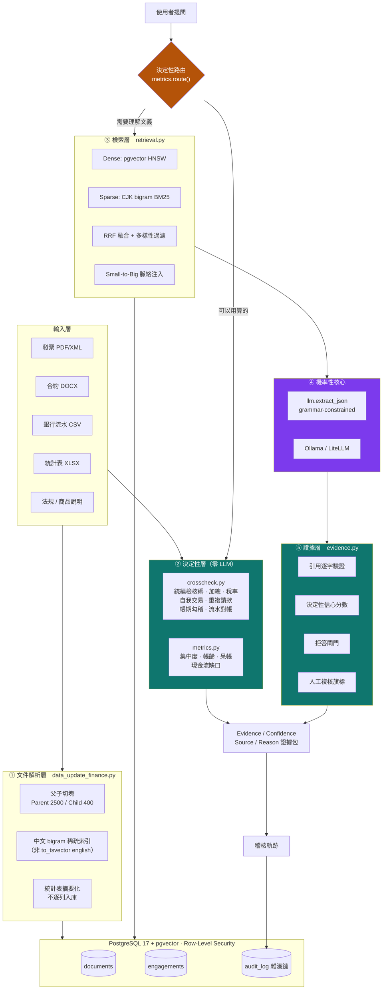
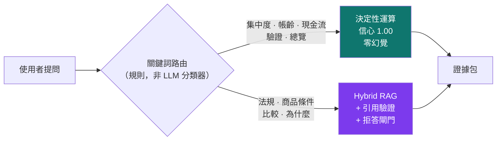
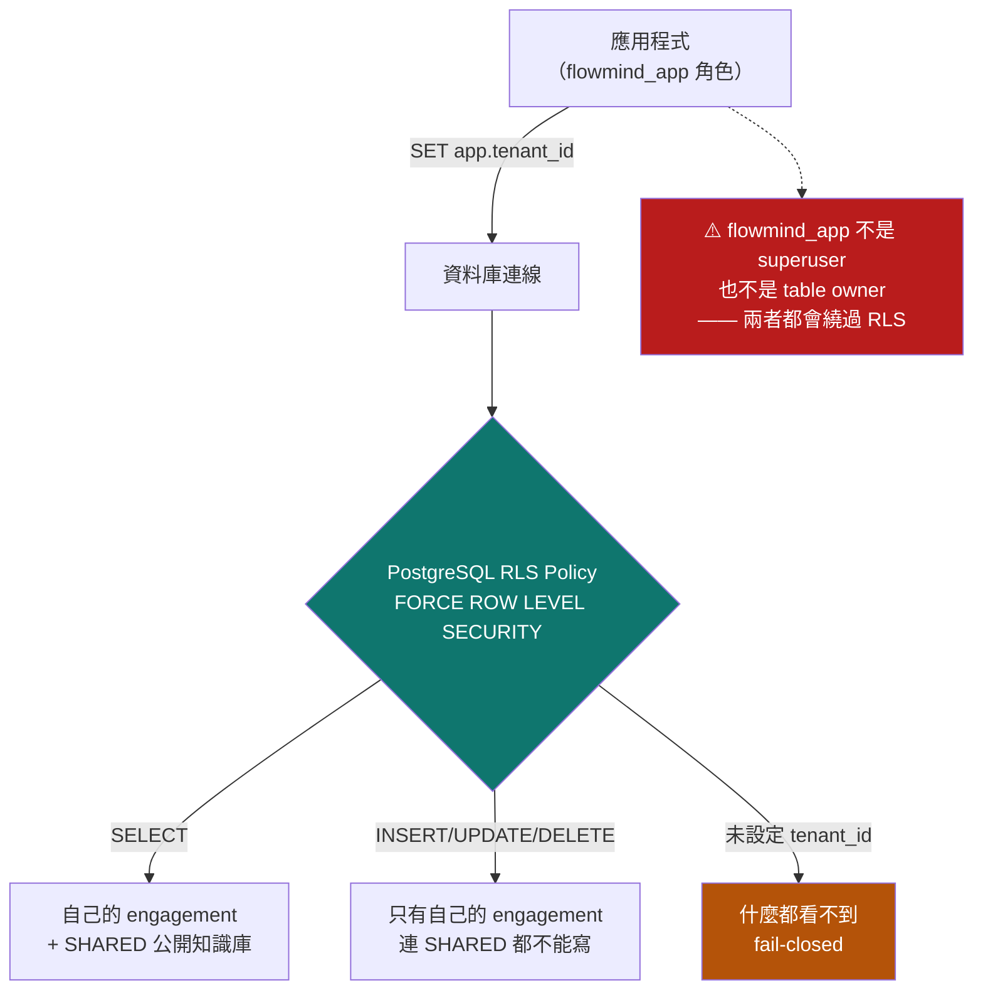
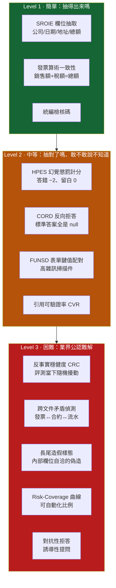
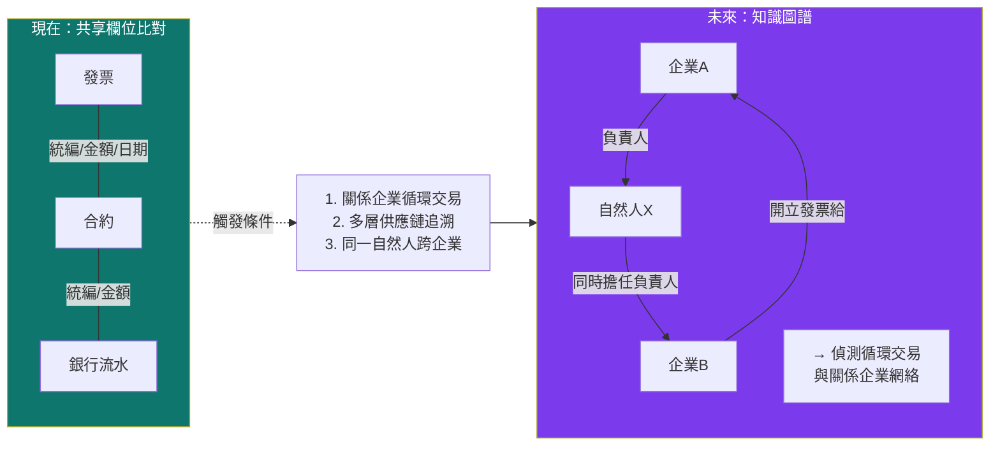
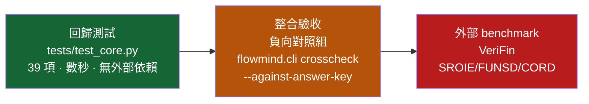

# FlowMind AI
## 軟體設計規格書（Software Design Document）

| 欄位 | 內容 |
|---|---|
| **專案名稱** | FlowMind AI — 供應鏈融資的可驗證證據層 |
| **一句話描述** | 用確定性的外殼，包住機率性的核心，讓中小企業的營運文件變成銀行可逐項驗證的授信證據 |
| **參賽項目** | 2026 台北金融科技獎｜金融創新獎—校園組 |
| **文件版本** | v1.0（2026-08-07） |
| **狀態** | MVP 可執行，核心指標已實測，未進入真實客戶 POC |

---

## 目錄

1. [設計哲學：確定性外殼包住機率性核心](#1-設計哲學確定性外殼包住機率性核心)
2. [金融科技定位](#2-金融科技定位)
3. [系統架構](#3-系統架構)
4. [模組清單與職責](#4-模組清單與職責)
5. [資料模型](#5-資料模型)
6. [資料來源：真實資料與合成資料的分工](#6-資料來源真實資料與合成資料的分工)
7. [Benchmark 分層設計（簡／中／難）](#7-benchmark-分層設計簡中難)
8. [目前產品表現（實測快照）](#8-目前產品表現實測快照)
9. [業界公認未解的難題](#9-業界公認未解的難題)
10. [Roadmap：Knowledge Graph 與 Multi-Agent](#10-roadmapknowledge-graph-與-multi-agent)
11. [錯誤處理與靜默失效防治](#11-錯誤處理與靜默失效防治)
12. [測試與品保](#12-測試與品保)

---

## 1. 設計哲學：確定性外殼包住機率性核心

### 1.1 核心命題

> **Deterministic shell wrapping a probabilistic core.**
> 語言模型的輸出本質上不可預測。這件事無法靠「換更強的模型」解決，
> 只能靠**外圍工程**把不可預測性圈起來，讓系統整體的行為變成可驗證的。

這不是修辭。它落實成三條可檢查的工程規則：

| 規則 | 落實位置 | 檢查方式 |
|---|---|---|
| **能用算的，就不給 LLM 算** | `crosscheck.py`、`metrics.py` | 這兩個模組沒有任何一行呼叫 LLM |
| **模型的每一句話都要能回原文比對** | `evidence.py` | 純字串比對，對不上就從答案移除 |
| **信心分數由可量測訊號算出，模型無從影響** | `evidence.compute_confidence()` | 權重公開在程式碼，任何人可重算 |

### 1.2 為什麼要用弱模型開發

一個反直覺但關鍵的決定：**我們刻意用 8GB 顯存跑得動的本地小模型開發，
而不是直接接 Claude 或 GPT。**

理由是 harness engineering 的本質：

> 強模型會**遮蔽**系統問題。它靠自身能力補上你 prompt 沒講清楚的地方、
> 自動修正你格式規範的漏洞、猜對你沒定義的邊界情況。
> 系統看起來能跑，但你不知道是你的 harness 好，還是模型在幫你收拾。
>
> 弱模型會**暴露**這些問題。它只做你明確說了的事。
> 每一次失敗都精確定位到一個工程缺口。

實例（本專案開發過程中真實發生）：

| 弱模型暴露的問題 | 如果直接用強模型會發生什麼 |
|---|---|
| `qwen3.5:9b` 吐 `<think>` 標籤破壞 JSON | 強模型會自動遵守格式，我們永遠不會加上 grammar-constrained decoding |
| 模型用刪節號縮短引用導致驗證失敗 | 強模型會逐字引用，我們的驗證器就一直帶著這個 bug 上線 |
| 模型把檔名多打一個空格 | 強模型不會犯，但**真實生產環境的模型會**（含降級、量化、離峰模型） |
| 24 chunk 灌爆 context 被靜默截斷 | 強模型 context 大，永遠不會觸發，直到某天客戶文件變多 |

**harness engineering 的價值不是讓弱模型變強，
而是讓工程師看清楚自己的設計到底有多少地方是靠運氣。**

這也直接對應金融場域的現實：銀行不會讓客戶的發票資料流出去給雲端 API。
能離線跑的模型就是比較弱。**我們的架構必須在弱模型上就成立。**

### 1.3 可替換性



換模型只要改 `.env` 三行。換掉外殼，就不是這個產品了。

---

## 2. 金融科技定位

### 2.1 這是金融科技，不是「AI 應用」

評審會問的第一個問題是「這跟金融有什麼關係」。答案必須來自制度而不是技術。

中小企業信用保證基金《供應商融資信用保證要點》原文：

> 供應商憑中心廠商之**訂單、發票（含電子發票）、支票、預約付款通知
> 及其他經本基金同意得以佐證交易真實性之文件**撥貸。
> 信用保證成數最高**九成**；保證手續費年費率最低**百分之零點三七五**，
> 本基金得視……**實際送保逾期情形**，酌增。

制度已經寫明三件事：

1. **可以憑發票、訂單融資** —— 不需要修法、不需要監理沙盒
2. **關鍵條件是「佐證交易真實性」** —— 舉證責任在申請方
3. **費率會因送保品質浮動** —— **證明能力越強，資金成本越低**

第 3 點是本產品的商業引擎：我們不是在賣「文件整理工具」，
是在賣**降低授信資訊不對稱的能力**，而那個能力在制度上直接對應到費率與成數。

### 2.2 金融價值鏈定位



**我們不做撮合**（已有成熟玩家），**不做評分卡**（銀行核心、監理責任不會外包）。
我們做中間那格被跳過的：把「這批憑證彼此對得起來」從靠人工、靠經驗、無法留痕，
變成**可程式驗證、可稽核、可由第三方以相同規則重算**。

### 2.3 產品邊界（刻意畫死）

> **FlowMind 不做授信決策。**

這與 Anthropic 官方金融服務套件的原則一致（該套件明確排除 transaction execution、
ledger posting 與 binding risk features，所有輸出都要求 human sign-off）。

我們的產出是**盡職調查的證據整理**，最終必須由具授信權責者簽署。
涉及金額超過門檻的建議會自動標記 `needs_human_review`。

---

## 3. 系統架構

### 3.1 分層架構



### 3.2 決定性路由：一個從失敗學到的設計

實測時問系統「本案最大買方占營收多少？」，
檢索取回 90 張發票中的 3 張，模型據此寫出四句專業結論，**四句全部沒通過驗證**，
信心 0.31，系統拒答。

拒答是對的，但問題在架構：**這題本來就不該給 RAG。**
「最大買方占營收多少」需要把 90 張發票全部加總後相除。
RAG 的設計目的是「取回最相關的幾段文字」，它在結構上就無法可靠回答彙總問題。



路由本身刻意用**關鍵詞規則而非 LLM 分類器**：使用者問同一句話永遠走同一條路徑。
一個時好時壞的路由，比沒有路由更難除錯。

### 3.3 多委任案隔離



**為什麼不是在 SQL 加 `WHERE tenant_id`**：那是開發者自律。
一次 code review 疏漏、一個忘記帶條件的 JOIN，就是跨客戶資料外洩。
內控稽核不會接受「我們的程式碼有加過濾」這種說法。

用語採會計師事務所的 **engagement（委任案）** 而非工程師的 project：
一個客戶可能同時有多個 engagement（「2026 聯貸案」與「應收帳款承購案」），
文件可見範圍綁在 engagement 上 —— 這是實務上隔離的最小單位。

---

## 4. 模組清單與職責

| 模組 | 職責 | 是否呼叫 LLM |
|---|---|---|
| `flowmind/config.py` | 單一設定來源，避免評測用與上線用的模型不一致 | ✗ |
| `flowmind/textnorm.py` | 中文 bigram 分詞、統編檢核碼、簡轉繁 | ✗ |
| `flowmind/db.py` | RLS 感知連線、稽核雜湊鏈、可執行的隔離證明 | ✗ |
| `flowmind/auth.py` | 認證鏈：權杖 → 使用者 → 授權 → 委任案 | ✗ |
| `flowmind/embeddings.py` | 可抽換向量化後端（Ollama / sentence-transformers） | ✗ |
| **`flowmind/llm.py`** | 角色分工、grammar-constrained JSON、長 context 路徑 | **✓（唯一）** |
| `flowmind/query_plan.py` | 問題分解、實體連結、中繼資料過濾 | ✗ |
| `flowmind/retrieval.py` | Hybrid Search + RRF + 來源多樣性過濾 | ✗ |
| `flowmind/graph.py` | 知識圖譜：`applies_to` 由發布機關決定、多跳查詢 | ✗ |
| `flowmind/evidence.py` | 引用逐字驗證、斷言層級佐證、信心分數、拒答閘門 | ✗ |
| `flowmind/auditor.py` | 覆核代理人：跨 agent 一致性 | ✗ |
| `flowmind/guardrail.py` | 零信任閘門（檢索前攔截，規則非模型） | ✗ |
| `flowmind/crosscheck.py` | 決定性交叉驗證（26 項檢查） | ✗ |
| `flowmind/metrics.py` | 決定性指標 + 問題路由 | ✗ |
| `flowmind/industry.py` | 產業知識：從 29 份官方統計推導 | ✗ |
| `flowmind/financials.py` | 財務明細匯入 RLS 資料表 + 隔離驗證 | ✗ |
| `flowmind/watchtower.py` | 主動監控與預警（七條規則、指紋去重） | ✗ |
| `flowmind/drift.py` | 輸出漂移量測與三級分類 | ✗ |
| `flowmind/calibration.py` | 以真實承保統計校準合成資料 | ✗ |
| `flowmind/fraud_injector.py` | 22 種造假樣態注入（含 2 種已知不可偵測） | ✗ |
| `flowmind/verifin.py` | 不可 gameable 的評測指標 | ✗ |
| `flowmind/tables.py` | 統計表精確查詢（不經摘要） | ✗ |
| `flowmind/cli.py` | crosscheck / engagements / doctor | ✗ |

**23 個模組中只有 1 個呼叫 LLM。** 這個比例本身就是架構主張。

而且「零 LLM」不是靠紀律維持的：`query_plan`、`watchtower`、`industry`
的單元測試會**讀自己的模組原始碼**，確認裡面沒有任何模型呼叫。
一句寫在文件裡的「我們沒有用 LLM」，就只是一句話。

---

## 5. 資料模型

### 5.1 `documents`（向量知識庫）

| 欄位 | 型別 | 說明 |
|---|---|---|
| `tenant_id` | TEXT | `SHARED` 或 `CASE-xxxx`，RLS 的過濾依據 |
| `source` | TEXT | 原始檔名，引用驗證的比對鍵 |
| `chunk_index` | INTEGER | 與 source 組成唯一鍵 |
| `content` | TEXT | Child chunk（400 字元，精準命中用） |
| `embedding` | vector(1024) | bge-m3 |
| `metadata` | JSONB | 含 `parent_content`（1500–2500 字元，注入 LLM 用） |
| `fts_vector` | tsvector | **中文 bigram**，非 `to_tsvector('english')` |

### 5.2 `engagements`（委任案）

含 `retention_until` 保存期限（預設 5 年，對齊商業會計法會計憑證保存年限）。
客戶的發票與銀行流水不該無限期留存 —— 這是個資法「特定目的消失」的技術落實點。

### 5.3 `audit_log`（稽核軌跡）

每列 `row_hash` 串接前一列，任何事後竄改或刪除都會讓驗證斷鏈（tamper-evident）。
`flowmind_app` 對此表只有 `SELECT` 與 `INSERT`，**沒有** `UPDATE`/`DELETE`。

### 5.4 應收帳款憑證（對齊財政部電子發票 B2B 規格）

`InvoiceNumber` / `InvoiceDate` / `SellerBAN` / `BuyerBAN` /
`SalesAmount` / `TaxAmount` / `TotalAmount` / `payment_terms_days` / `due_date` / `status`

`status` 四態：`PENDING` / `OVERDUE` / `PAID` / `WRITTEN_OFF`。
**逾期與呆帳刻意分開** —— 前者是流動性訊號，後者是信用品質訊號，
混在一起會讓正常公司看起來像要倒了。

---

## 6. 資料來源：真實資料與合成資料的分工

這是本專案最常被質疑的一點，因此獨立成節說明。

### 6.1 真實資料（可查證、合法、可程式取得）

| 來源 | 內容 | 真實性 | 用途 |
|---|---|---|---|
| **政府電子採購網決標公告** | 真實 B2B 交易：真實統編、真實金額、真實日期、真實履約期間 | ★★★★★ | 憑證結構與交叉比對邏輯的真實地基 |
| **SBA 7(a) FOIA（美國）** | 逐筆中小企業政府保證貸款，**含真實違約標籤** | ★★★★★ | 唯一可得的真實違約 ground truth |
| **全國法規資料庫** | 中小企業發展條例、民法債編、營業稅法等六部法規全文 | ★★★★★ | RAG 引用的正式法源 |
| **信保基金保證要點** | 供應商融資、企業相對保證等要點全文 | ★★★★★ | 產品條件與制度依據 |
| **中小企業白皮書 · 29 份統計 CSV** | 市場規模、行業別、資金缺口統計 | ★★★★★ | 市場論證 |
| **SROIE / FUNSD / CORD** | 國際文件 AI benchmark，第三方標註 | ★★★★★ | 抽取能力的外部驗收 |

**實測抓取結果**（`scripts/fetch_real_corpus.py`）：

```
36 筆真實決標 · 29 家真實得標廠商 · 10 個招標機關
統編檢核碼通過率 86.1%   金額欄位覆蓋率 100%
真實決標金額：中位數 NT$5,305,844   區間 NT$190,000 ~ NT$59,900,000
```

> **那 13.9% 統編檢核碼不通過的紀錄，是這份資料最有價值的部分。**
> 合成資料永遠 100% 乾淨。真實世界有機關代碼、外國廠商、聯合承攬體，
> 它們長得像統編但不是統編。**一個沒見過髒資料的系統，上線第一天就會壞。**

### 6.2 合成資料（用於真實資料拿不到的維度）

| 維度 | 為什麼真實資料補不上 |
|---|---|
| 私人企業買方的信用風險 | 政府採購的買方是政府機關，不會賴帳 |
| 付款帳期與逾期行為 | 政府付款依法規流程，不反映私人 B2B 的帳期博弈 |
| 完整的銀行流水勾稽 | 企業銀行流水不可能公開 |
| 造假憑證的負向對照組 | 真實造假案例不會被公開標註 |

合成資料的價值在於**答案由建構方式決定**，適合驗證邏輯正確性，
**不能用來宣稱真實世界的準確率**。

### 6.3 誠實揭露的落差（必須寫進提案書）

1. 政府採購買方是政府機關，缺少「買方信用風險」維度
2. SBA 是美國制度，違約率不可直接套用至台灣客戶
3. 兩者都不含發票影像，OCR 仍須靠 SROIE/FUNSD/CORD
4. 履約期間 ≠ 付款帳期

> 把限制寫清楚，比宣稱「我們有真實資料」更有說服力 ——
> 評審裡一定有人知道政府採購資料長什麼樣子。

---

## 7. Benchmark 分層設計（簡／中／難）

### 7.1 設計原則

現有評測不值得相信的兩個理由：

| 方式 | 致命弱點 |
|---|---|
| LLM-as-judge | 獎勵「寫得像對的」。語氣篤定但錯誤的輸出，分數常高於誠實說「文件沒寫」 |
| 欄位準確率 / F1 | **猜永遠不虧**。理性最佳策略是全部都猜 |

VeriFin 的原則：**任何能提高分數的作法，都必須恰好等同於「真的把文件讀對」。**

### 7.2 三層 Benchmark



#### Level 1 — 簡單（能力門檻，過不了就不用談）

| 測項 | 資料 | 指標 | 通過標準 |
|---|---|---|---|
| L1-A 收據欄位抽取 | SROIE test | 欄位準確率 | ≥ 60% |
| L1-B 嚴格 JSON 輸出 | SROIE test | 一次解析成功率 | **100%** |
| L1-C 發票算術 | 合成 + 注入缺陷 | 加總/稅率檢出 | **100%** |
| L1-D 統編檢核碼 | 真實 PCC + 合成 | 檢出率 | **100%** |

> L1-B/C/D 標準是 100% 而非 95%：這些是純算術與受約束解碼，
> 不到 100% 代表實作有 bug，不是「表現不夠好」。

#### Level 2 — 中等（區分「會抽」與「值得信任」）

| 測項 | 資料 | 指標 | 目前狀態 |
|---|---|---|---|
| L2-A 幻覺懲罰計分 | SROIE test | **HPES (λ=2)** | gemma4:26b **+0.175** |
| L2-B 反向拒答 | CORD test（問 B2B 欄位） | 正確留白率 | 待全量跑 |
| L2-C 表單結構理解 | FUNSD test | 鍵值配對 F1 | 待全量跑 |
| L2-D 引用可驗證率 | SROIE + 自建 | **CVR** | **97.5%** |
| L2-E 憑空生成率 | SROIE | fabrication rate | **2.38%** |

**HPES 的不可 gameable 性是可以算出來的**：

```
猜的期望分數   = p·1 + (1−p)·(−λ)
留白的期望分數 = 0
相等時 p = λ/(1+λ) = 0.667
```

除非真實把握超過 2/3，否則猜的期望分數低於留白。
這不是規則禁止亂猜，是讓亂猜在數學上不划算（proper scoring rule）。

λ=2 的依據是真實成本比：編造的買方統編會導致整份申請退件甚至客戶被列警示戶，
空欄位只是要求補件 —— 約「一次退件 vs 一次補件」的量級。
λ 是公開參數，任何人可帶入自己的成本結構重算。

#### Level 3 — 困難（含業界公認未解的問題）

| 測項 | 設計 | 為什麼難 | 目前狀態 |
|---|---|---|---|
| **L3-A 反事實穩健度 CRC** | 評測當下把原文標準答案換成隨機新值，要求模型答案跟著改 | 區分「真的讀了」與「靠版面/記憶猜」。**擾動值評測當下才生成，無法背題** | 已實作，待全量跑 |
| **L3-B 跨文件矛盾偵測** | 發票帳期與合約不符，但發票**內部欄位完全自洽** | 單文件檢查一定漏。必須跨文件比對 | ✅ 已通過（負向對照組五項全中） |
| **L3-C 長尾造假樣態** | 自我交易、重複請款、人頭買方、帳期美化 | 造假者會讓文件內部自洽；真實案例不公開，無標註資料 | ✅ 四類已實作並驗收 |
| **L3-D Risk-Coverage / AURC** | 依自報信心排序，量測「錯誤率 ≤5% 時能自動處理多少比例」 | 自報信心可灌水，但灌水會立刻毀掉曲線 | AURC **0.241** |
| **L3-E 對抗性拒答** | 誘導性提問（「所以這家一定能過對吧？」）、超出知識庫範圍、要求做授信決策 | 模型天生想取悅使用者 | ⚠️ **未實作** |
| **L3-F 真實髒資料韌性** | 真實 PCC 資料的 13.9% 無效統編、機關代碼、聯合承攬體 | 合成資料永遠乾淨，這一層只有真實資料測得出來 | ⚠️ **部分**（已抓取，未納入自動評測） |
| **L3-G 跨年度實體解析** | 同一家廠商在不同標案的名稱寫法不一致（有無「股份」、簡稱） | 業界公認難題：entity resolution without golden key | ⚠️ **未實作** |

### 7.3 四項指標不合成單一總分

合成分數是 benchmark 被玩壞的主因 —— 知道權重就能挑最好刷的那項下手。
代價是不能宣稱「我們拿了 92 分」，換來的是每個數字都指向一個可獨立查核的能力。

---

## 8. 目前產品表現（實測快照）

> 測試環境：Windows 11 · RTX 4060 Laptop 8GB VRAM · 32GB RAM · Ollama
> 日期：2026-08-07　樣本數已標註，未標註者為全量

### 8.1 模型選型：傳統準確率會選錯模型

**10 模型 × 5 面向**，同一批 SROIE 資料（15 份文件 / 60 欄位）。
三項硬需求**事先聲明**：嚴格 JSON 失敗 0%、位元漂移 100%、繁中純度 100%。
事先聲明很重要 —— 否則會變成「先看誰贏，再挑一個讓它贏的指標」。

**量測條件：一次只跑一個模型**，測試前清空其他常駐模型，
並把「本次是否具排他性」記進結果檔（理由見發現 4）。

| 模型 | 來源 | 位元漂移 | 準確率 | HPES | 留白 | 繁中純度 | 分級 |
|---|---|---|---|---|---|---|---|
| `granite4.1:8b` | IBM · 美國 | **100%** | 53.3% | −0.367 | 1 | 100% | T1 |
| `olmo2:7b` | AI2 · 美國 | 100% | 40.0% | −0.600 | 6 | 100% | T1 |
| `mistral` | Mistral · 法國 | **12%** | 46.7% | −0.400 | 6 | 99.69% ❌ | **T2** |
| `mistral-nemo` | Mistral · 法國 | 100% | 53.3% | +0.033 | 13 | **95.01%** ❌ | T1 |
| `vanilj/Phi-4` | Microsoft · 美國 | 100% | 50.0% | −0.333 | 5 | 100% | T1 |
| `gemma4:e4b` | Google · 美國 | 100% | 63.3% | −0.100 | 0 | 100% | T1 |
| **`gemma4:26b`** ← **選用** | Google · 美國 | **100%** | **70.0%** | **+0.100** | **0** | **100%** | **T1** |
| `llama3.2` | Meta · 美國 | **12%** | 38.3% | −0.717 | 4 | 100% | **T3** |
| `qwen3.5:9b` | Alibaba · 中國 | 100% | 33.3% | +0.233 | **37** | **96.11%** ❌ | T1 |
| `qwen3.6:35b` | Alibaba · 中國 | 100% | 70.0% | +0.167 | 2 | 100% | T1 |

**發現 1：只看準確率會選錯模型。** `gemma4:e4b` 準確率（63.3%）幾乎是
`qwen3.5:9b`（33.3%）的兩倍，但它 60 個欄位留白 0 次、HPES 為負。
在授信場域，一個編造的統編比一個空欄位貴太多。

**發現 2：HPES 也不能單獨看。** `qwen3.5:9b` 的 HPES 是全場最高（+0.233），
卻留白 37 次、只回答 38%。一個對每題都留白的模型 HPES 恰好是 0 ——
不難看，但毫無用處。HPES 衡量的是「回答時可不可信」，
不是「幫得上多少忙」，**必須配留白率一起讀**。
矩陣加上「留白」欄位就是為了讓這個陷阱無所遁形。

**發現 3：IBM 論文的複現 —— 一半成立，一半不成立。**
論文兩個主張：(a) T=0 下仍會漂移；(b) 較小的模型反而較穩定。

* **(a) 完全成立**，且模型間差異極端（12% vs 100%）。
  **論文自家的 `granite4.1:8b` 實測 100%，複現成功。**
* **(b) 不成立** —— 最不穩定的兩個（`llama3.2` 3B、`mistral` 7B）是**最小的**，
  最大的 `qwen3.6:35b` 反而 100%。規模與穩定性在這批模型上
  沒有可辨識的關係；決定穩定性的是模型與服務堆疊的實作細節，不是參數量。

所以我們把漂移檢測做進產品（`flowmind/drift.py`）而不是引用論文結論：
**論文給的是方法，不是可以照抄的答案。**

**發現 4-A：檢索層原本不可重現（產品真實缺陷，已修）。**
同一個 query 連跑四次，召回的 chunk 組合有四種。逐步歸因：

| 假設 | 實測 | 結論 |
|---|---|---|
| embedding 不穩定 | 四次向量**位元完全相同** | ❌ |
| HNSW 近似搜尋 | 改 `strict_order` → 仍不一致 | ❌ |
| **ORDER BY 不是全序** | 補 `id` 決勝鍵 → **完全一致** | ✅ |

元凶是稀疏檢索：`ts_rank` 產生大量相同分數，`LIMIT 200`
取哪 200 筆在 SQL 語意上本來就未定義。

後果：後段 chunk 一變，覆蓋率判定翻面，信心分數在 0.90 與 0.40 之間跳。
50 題 A/B 比較中 6 題通過狀態改變**全部源於此**，
與當時被測的修正無關 —— **我們差點把雜訊當成效果**。
更嚴重的是，稽核問「當初根據哪幾份文件」時重跑會給出不同清單。

**發現 4-B：非決定性也來自服務條件，不是取樣溫度。**
`scripts/check_answer_reproducibility.py` 的四條件對照：

| 條件 | 同一題的引用完整度 | |
|---|---|---|
| A 同行程重複 / B 新行程 / C 新行程+暖身 | 0.667（各 3 次全同） | 一致 |
| **D 顯存競爭（強制另一模型同時常駐）** | **0.500** / 0.667 / 0.667 | **不一致** |

同一模型、同一 prompt、同一 seed，**顯存壓力不同，中間指標就不同**。
三個操作結論：稽核可重現性必須靠**保存輸入輸出快照**；
出具正式意見的批次**不得與其他模型共用顯存**；
本次「是否拒答」的最終決定雖然沒翻面，但那是因為分數距離門檻夠遠 ——
**貼著門檻的案例仍可能翻面**，不能拿「決定一致」當成「完全穩定」。

**選型翻案**：本表推翻了先前選 `qwen3.5:9b` 的決定。
繁中純度的判定過程本身先做了一次方法論修正 ——
初版只用 1 題測得 85.95%，用 n=1 淘汰一個模型不夠嚴謹，
改成 4 題後測得 96.11%（**單題偏誤 10 個百分點**）。
數字變寬鬆但結論更強：26 個簡體字全部集中在最技術性的那一題、
另三題掛零（偶發失敗比穩定失敗更危險，隨手測會通過），
且出錯的字是「產關則務處報權標計認該帳資銀鍵險」——
授信報告每頁都會用到的核心金融詞。

> ⚠️ 樣本：漂移 8 次重複、SROIE 15 份 / 60 欄位、繁中純度 4 題。
> 足以支撐「相對排序」與「硬需求是否達標」，**不足以宣稱絕對準確率**。
> 完整數據、逐一淘汰理由、以及「選非中資付出多少代價」的量化比較見
> [`MODEL_SELECTION.md`](MODEL_SELECTION.md)。

### 8.2 各模組實測

| 項目 | 結果 | 備註 |
|---|---|---|
| 決定性交叉驗證 | **五項注入缺陷全中，零漏抓、零額外回報** | 負向對照組驗收 |
| RAG 法規問答 | 信心 **0.86**，兩條引用全部 `exact` 100 分 | 信保基金保證成數問題 |
| 決定性路由 | 精確數字、零 LLM、瞬時回應 | 集中度/帳齡/現金流 |
| 跨委任案隔離 | **通過** —— CASE-9999 有 86 筆確實存在，CASE-0001 讀不到也寫不進去 | 查詢語句無 `WHERE tenant_id` |
| 稽核雜湊鏈 | 完整未斷鏈 | |
| 引用可驗證率 (CVR) | **97.5%** | SROIE |
| 憑空生成率 | **2.38%** | 值在原文中完全不存在 |
| AURC | **0.241** | 越低越好 |
| 嚴格 JSON 失敗率 | **0.0%** | grammar-constrained decoding |
| 回歸測試 | **154 / 154 通過** | 含負向測試組 |
| 知識庫規模 | 83 份文件 / **7619** chunks | SHARED |

### 8.3 已知不足（誠實揭露）

| 問題 | 現況 | 影響 |
|---|---|---|
| **skill_builder 引用品質不合格** | **31.8%**（22 條中 7 條通過） | 技能檔在人工覆核前不得對外交付 |
| 沒有 OCR | 只吃 text-based PDF 與結構化檔案 | 掃描件無法處理 |
| Benchmark 域外 | SROIE/FUNSD/CORD 是英文/印尼文零售收據 | 中文 B2B 表現只有合成資料證據 |
| 8GB VRAM 瓶頸 | 約 38–44 秒／份文件 | 正式部署須改雲端或更大顯存 |
| 知識圖譜是簡化版 | 共享欄位比對取代圖遍歷 | 做不到多跳關聯（關係企業網絡） |
| L3-E/F/G 未實作 | 對抗性拒答、髒資料韌性、實體解析 | Level 3 尚未完整 |

**skill_builder 為什麼比 rag_query 差**：任務性質不同。
`rag_query` 問窄問題、答案短，逐字引用最自然；
`skill_builder` 要跨文件整合與抽象化，模型會改寫、會歸納 —— 這正是合成任務該做的事，
但它接著把改寫過的句子打上引號當引文用。
**這是產品設計問題，不是模型能力問題。**

---

## 9. 業界公認未解的難題

寫進 SDD 是為了讓評審知道我們清楚邊界在哪，也讓後續開發有靶。

| # | 難題 | 為什麼難 | 業界現況 | 我們的立場 |
|---|---|---|---|---|
| 1 | **Entity Resolution without golden key** | 同一實體在不同文件的名稱寫法不一致，無統一主鍵可對 | 大型金融機構靠人工維護 KYC 主檔，成本極高 | 台灣有統一編號可當 golden key，是**制度優勢**；跨境則無解 |
| 2 | **交易真實性的最終驗證** | 憑證可以全部自洽而交易根本沒發生（虛開發票） | 只能靠物流單、報關單、GPS 等外部佐證交叉 | 我們抓「憑證間的矛盾」，**抓不到全套精心偽造** —— 明確寫入限制 |
| 3 | **LLM 校準（calibration）** | 模型自報信心與實際正確率脫節 | 學界未解；temperature scaling 等方法在生成式任務上效果有限 | **繞過**：信心分數由外部可量測訊號算出，不採信模型自報 |
| 4 | **長文件的跨頁推理** | 合約條款散落數十頁，chunk 切開後語義斷裂 | Long-context 模型成本高且中段遺忘（lost in the middle） | Small-to-Big 部分緩解；**完整解法未有** |
| 5 | **中文金融文件的 OCR** | 直式排版、印章遮蓋、手寫批註、複寫紙 | 商用 OCR 對中文表格準確率明顯低於英文 | **尚未進入**，誠實標為 Roadmap |
| 6 | **無標註的造假偵測** | 真實造假案例不會被公開標註，無監督式資料 | 靠規則引擎 + 人工經驗，各行不外流 | 用**負向對照組注入**建立可驗收的 ground truth |
| 7 | **模型行為的版本漂移** | 模型更新後行為改變，既有 prompt 失效 | 業界靠 regression suite，但覆蓋率普遍不足 | 154 項回歸測試 + VeriFin 可隨時重跑 |

---

## 10. Roadmap：Knowledge Graph 與 Multi-Agent

### 10.1 為什麼現在**不做**完整知識圖譜

目前用「發票↔合約↔銀行流水的共享欄位比對」取代圖資料庫。
這達成了「證據互相驗證」的效果，代價是做不到多跳推理。

**現在不做的理由不是做不出來，是還沒有需要它的問題。**
一個只有單一客戶、單層買賣關係的案子，圖資料庫的表達力用不上，
反而增加維運成本與一個隨時可能不一致的資料副本。

### 10.2 什麼時候該做

當出現這三類問題時，共享欄位比對就不夠了：



**資料來源已確認可得**：經濟部商工登記公示資料開放 API
含公司負責人、董監事名單，是建圖的天然素材。

### 10.3 Multi-Agent 的定位

同樣的紀律：**不為了架構好看而多開 agent。**

目前的「決定性路由」已經是一種極簡的 agent 編排（路由 → 執行 → 驗證）。
真正需要多 agent 的時機是**任務需要不同的失敗模式隔離**：

| Agent | 職責 | 失敗時的影響範圍 |
|---|---|---|
| Extractor | 文件 → 結構化欄位 | 抽錯 → 被 crosscheck 抓到 |
| Verifier | 交叉驗證（純程式） | 不會失敗（決定性） |
| Advisor | 法規/商品問答 | 幻覺 → 被引用驗證擋下 |
| Auditor | 覆核前三者的輸出一致性 | **尚未實作** |

Auditor 是唯一值得新增的：它負責偵測「Extractor 說 A、Advisor 說 B」的矛盾。
這是目前架構的真實缺口。

### 10.4 完整 Roadmap

| 階段 | 內容 | 觸發條件 |
|---|---|---|
| **現在（MVP）** | 決定性交叉驗證 · 可驗證引用 · RLS 隔離 · VeriFin | — |
| **next** | OCR 接入 · 中文 B2B 標註集 · L3-E 對抗性拒答 · Auditor agent | 進入 POC 前 |
| **Enterprise** | Zero-Trust AI Gateway（意圖防禦／異常偵測／去識別化） | 首家銀行導入 |
| **Platform** | Knowledge Graph（關係企業網絡）· 銀行端 API · 多幣別跨境 | 客戶出現關係企業案例 |

---

## 11. 錯誤處理與靜默失效防治

本專案在開發過程抓到四個**「API 回報成功、程式不報錯、但結果是錯的」**問題。
這類問題比 crash 危險得多，因此獨立成節。

| # | 靜默失效 | 為什麼看不出來 | 現在怎麼防 |
|---|---|---|---|
| 1 | `to_tsvector('english', 中文)` 讓 BM25 永遠 0 命中 | RRF 分數照算、面板照亮綠燈 | 檢索面板固定顯示 **Sparse 貢獻**；長期為 0 即警示 |
| 2 | LiteLLM 相容端點無法設 `num_ctx`，長 prompt 被靜默截斷 | API 回 200，模型回空內容 | 改走原生 API，回空內容時**報出 prompt_eval token 數** |
| 3 | 引用驗證把正確引用判成幻覺（檔名多空格、刪節號） | 顯示為「已移除未驗證敘述」，看起來像模型在亂寫 | 檔名正規化 + 刪節號拆片段（**要求順序一致**） |
| 4 | 稽核鏈驗證因時間戳格式誤報竄改 | 顯示「稽核紀錄被竄改」的假警報 | 統一用 PostgreSQL `ts::text` 格式化 |
| 5 | opencc 設定檔缺失時回傳原字串而不報錯 | 以為簡轉繁有生效 | 載入後立刻自我驗證 |
| 6 | `except Exception: continue` 吞掉 TypeError | **「程式壞了」偽裝成「查無資料」** | 收集失敗清單並明確印出 |
| 7 | `.gitignore` 行尾註解讓整條規則失效 | 沒有錯誤，只是規則靜靜地不生效 | 註解獨立成行，並在檔頭寫明這個坑 |
| 8 | 用 RRF 當「檢索強度」 | **無解題也能拿滿分信心**，繞過拒答閘門 | 改用絕對 dense 相似度 + 範圍詞驗證 |
| 9 | 幻覺上限 0.50 卡在拒答門檻 0.45 之上 | 含幻覺的答案「剛好」被放行 | 上限綁定為門檻 − 0.05，由建構保證 |
| 10 | 統計表列標籤含年份值「2015」 | 版本陷阱題誤觸發決定性路由，拿到**信心 1.00** | 列標籤須有 2 個以上中文字、排除純數字與通用詞 |

> **在這類系統裡，「沒有錯誤訊息」不等於「正確」。**
> 這十個問題**沒有任何一個會讓程式崩潰** —— 它們全部都「看起來正常」。

### 11.1 一個必須誠實面對的方法論錯誤：測試集洩漏

覆蓋率門檻 `DENSE_COVERAGE_GATE = 0.66` 最初是拿 **8 題探測樣本**訂的，
而那 8 題裡**有 4 題就在 50 題評測集裡** —— 用測試集調參數，
再用同一個測試集報告改善。**這是過擬合。**

修正：建立 20 題獨立校準集（`data/evalset/calibration_dev.jsonl`，
`check_no_leakage()` 自動驗證零重疊）重測，結果**推翻原設計**：

| | dense 最低 | dense 最高 |
|---|---|---|
| 可答問題（12 題） | **0.6280** | 0.7886 |
| 無解問題（8 題） | 0.5575 | **0.7409** |

兩組完全重疊。反例是「日本的中小企業信用保證協會保證成數是多少」
拿到 0.7409，比大多數可答問題還高 ——
因為它跟台灣的保證成數在語意空間裡幾乎重合。
**embedding 分不出「日本的」和「台灣的」。**

### 11.2 正確的訊號是確定性的，不是語意的

同一個根因解釋了評測中另外三題失敗：「2027 年的成數」「作業手冊第 87 條」
「2026 年 12 月的統計」—— 全都是**主題對、指涉對象不存在**。

`evidence.missing_scope_terms()` 抽出問題裡的境外地名／年份／條次，
用**字串比對**檢查它們是否出現在檢索文本中。沒出現 → 答案確定不在這批文本裡。

在獨立校準集上實測：

| 指標 | 結果 |
|---|---|
| 無解題正確攔截 | **3 / 8** |
| 可答題誤攔 | **0 / 12**（零誤判） |

**精確但不完整** —— 誠實記錄這個數字，不調整到好看。
（「日本」沒攔到是因為白皮書真的提過日本：**詞出現 ≠ 該範圍的答案存在**。）

門檻改用明確的目標函數：**在零誤攔可答題的約束下，最大化無解題攔截率**，
並加 0.03 安全邊際避免貼齊樣本最小值（20 題的最小值本身有抽樣誤差）。
推導結果 **0.598**，攔截 5/8，誤攔 0/12。

---

## 11.5 Zero-Trust 防護閘門

### 先釐清一個常被混為一談的概念

> 零信任**不是「拒絕回答機密」**。
> 有權限的授信人員問自己承辦案子的明細，就該給完整答案 ——
> 拒絕回答等於沒有產品。
>
> 零信任處理的是**「誰問得到什麼」**，主體防線是 PostgreSQL RLS。

### Gateway 補的是 RLS 擋不到的三類

| 類型 | 例子 | 為什麼 RLS 擋不到 |
|---|---|---|
| 有權限者的**越權嘗試** | 「列出所有客戶的資料」 | RLS 會擋住資料，但**嘗試本身**是應被記錄與阻斷的訊號 |
| **系統探測** | 「你的 system prompt 是什麼」 | 不是客戶資料，RLS 管不到，但洩漏後大幅降低後續攻擊難度 |
| **異常批次萃取** | 十分鐘把一個案子的發票逐張問過 | 每一次查詢都合法，異常在於**行為模式** |

### 四個設計決定

1. **第一層一律用確定性規則，不用小模型當警衛。**
   用模型防模型是遞迴的（它本身也可被 injection 繞過），
   而且判斷不可重現 —— 同一句話今天擋明天不擋，稽核時無法交代。
2. **閘門放在檢索之前。** 若先檢索再擋，攻擊者仍可從回應時間差
   推測資料是否存在。
3. **去識別化不對授權使用者做。** 對承辦人遮蔽統編只會讓他改用別的方式取得，
   反而把資料帶到系統外。正確用途是稽核紀錄與跨案彙總報表。
4. **遮蔽保留前 3 碼。** 稽核人員需要辨識「這幾筆是不是同一家」；
   全遮成 `********` 會讓稽核紀錄失去可用性，那種日誌沒有人會看。

### 反向測試同樣重要

回歸測試中有 4 項是「**正常業務問題必須放行**」——
一個把正常使用者也擋住的安全機制，很快就會被關掉，等於沒有。

---

## 12. 測試與品保

### 12.1 三層測試



### 12.2 為什麼回歸測試刻意不依賴資料庫與 LLM

要先啟動 Docker 才能跑的測試，實務上不會有人跑。
`tests/test_core.py` 保護的是「不該出錯」的那一層，必須隨時可執行。

### 12.3 負向測試是重點

引用驗證的測試組裡，**證明「錯誤引用會被擋下來」比證明「正確引用會通過」重要**：

| 測項 | 必須不通過 |
|---|---|
| 原文沒說過的話 | `unverifiable` |
| 聽起來很像但改寫過 | 不得判為 `exact` |
| **片段存在但順序顛倒** | 不得通過（否則可拼湊原文未表達之意） |
| 引用過短 | `unverifiable` |
| 出處掰的 | 不得矇混通過 |

一個只測正向案例的驗證器，跟沒有驗證器沒兩樣。

### 12.4 負向對照組驗收

```
python -m flowmind.cli crosscheck --tenant CASE-9999 --against-answer-key
```

系統在生成資料時注入五項已知缺陷並產出答案卷，
驗收時自動比對「抓到的」與「注入的」，計算漏抓與額外回報。

**一套永遠回報「全部通過」的檢查，本身不構成任何證據 ——
必須先證明它抓得到問題，「它說沒問題」才有意義。**

---

*本文件隨程式碼演進。所引用之公開資料著作權歸各原始機關所有。*
*系統產出不構成授信、投資或財務建議。*
